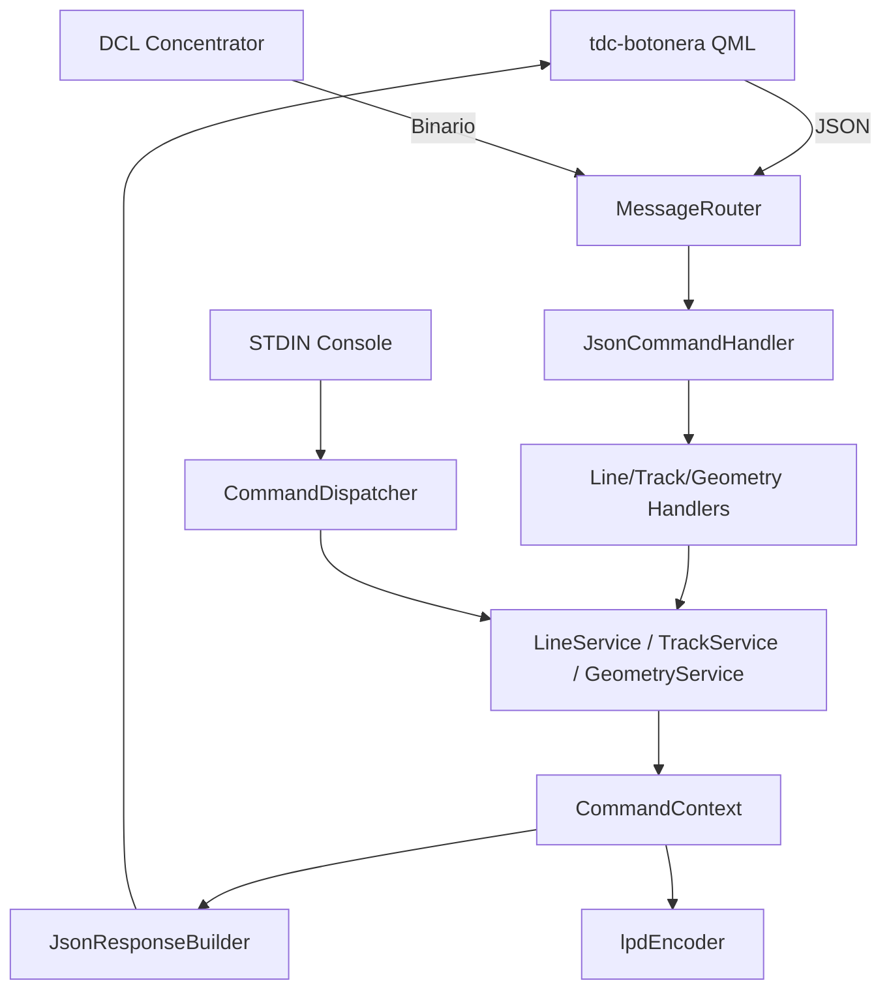

- Backend: "DDM" — Qt6 C++17, procesa datos binarios del concentrador (DCL), expone comandos JSON y una consola (stdin) con comandos tipo `sitrep`, `add`, `delete`.
- Frontend: "tdc-botonera" — QML UI (Botonera / DDM) que envía/recibe JSON vía `ITransport` y muestra el SITREP en pantalla.

El flujo principal: Mensajes entrantes → `MessageRouter` (backend) → adaptadores (handlers JSON / dispatcher CLI) → services de dominio → `CommandContext` (estado) → respuestas JSON + encoder binario hacia hardware.



---

## Estructura de carpetas (resumen)
- DDM/
  - DDM.pro
  - docs/
    - architecture.md
    - README_BACKEND_ARCHITECTURE.md
  - src/
    - main.cpp
    - controller/
      - messagerouter.*
      - commands/
      - handlers/
    - model/
      - commandContext.h
      - decoders/
      - entities/
      - enums/
- tdc-botonera/
  - botonera/
    - DDM/ (QML UI)
      - SitrepWorkspace.qml
    - src/
      - controller/
        - protocol/
          - ddmcontroller.h
          - ddmcontroller.cpp

(Usa la vista del repo para navegar a los archivos mencionados.)

---

## Arquitectura general

### Backend (DDM)
- MessageRouter (`src/controller/messagerouter.cpp`) decide si el mensaje es JSON (frontend) o binario (DCL) y lo enruta.
- `JsonCommandHandler` mantiene un `m_commandMap` con comandos de linea, track y geometría (`create_line`, `delete_track`, `create_polygon`, `delete_polygon`, `list_shapes`, etc.).
- Los handlers (`LineCommandHandler`, `TrackCommandHandler`, `GeometryCommandHandler`) funcionan como adaptadores de entrada/salida y delegan la lógica de negocio en services.
- `CommandContext` (header-only) es el estado único compartido: `lines`, `tracks`, `areas`, `circles`, `polygons`, centro X/Y y contadores de IDs.
- Decoders/Encoders:
  - `concDecoder` decodifica mensajes binarios del hardware.
  - `lpdEncoder` genera paquetes periódicos hacia hardware (cada 40 ms por timer).
- CLI: comandos en `src/controller/commands/` usan el mismo backend de services que JSON, evitando duplicación.

Referencias clave:
- [src/main.cpp](../src/main.cpp)
- [src/controller/messagerouter.cpp](../src/controller/messagerouter.cpp)
- [src/controller/json/jsoncommandhandler.cpp](../src/controller/json/jsoncommandhandler.cpp)
- [src/controller/services/lineservice.cpp](../src/controller/services/lineservice.cpp)
- [src/controller/services/trackservice.cpp](../src/controller/services/trackservice.cpp)
- [src/controller/services/geometryservice.cpp](../src/controller/services/geometryservice.cpp)
- [src/model/commandContext.h](../src/model/commandContext.h)

### Frontend (Botonera / QML)
- `DDMController` (C++ QObject) parsea respuestas JSON y expone `tracksList` (QVariantList) a QML.
- `SitrepWorkspace.qml` consume `ddmController.tracksList` y renderiza la tabla SITREP.
- Transport layer: Local IPC o UDP según `Configuration`.

Referencias:
- [tdc-botonera/botonera/src/controller/protocol/ddmcontroller.h](tdc-botonera/botonera/src/controller/protocol/ddmcontroller.h)
- [tdc-botonera/botonera/DDM/SitrepWorkspace.qml](tdc-botonera/botonera/DDM/SitrepWorkspace.qml)

---

## Formato de mensajes JSON (resumen)
Comunicación estándar JSON entre backend y frontend:

### Comandos disponibles (backend)

- Lineas: `create_line`, `delete_line`
- Tracks: `create_track`, `delete_track`, `list_tracks`
- Geometría: `create_area`, `delete_area`, `create_circle`, `delete_circle`, `create_polygon`, `delete_polygon`, `list_shapes`

Ejemplo base de respuesta:
```json
{
  "status": "success",
  "command": "list_tracks",
  "args": { "tracks": [ /* objetos track */ ] }
}
```

Campos importantes de un `track` en JSON (backend → frontend):
- `id`: entero / id único
- `identity`: string (Identidad: AMIGO / HOSTIL / Pending / etc.)
- `azimut`: número (grados)
- `distancia`: número (Nm o unidades internas)
- `rumbo`: entero
- `velocidad`: número
- `link`: string (`TX`, `RX`, `--`)
- `info`: string (información ampliatoria — se envía desde `addCommand`)

Archivos relevantes:
- [src/controller/handlers/trackcommandhandler.cpp](../src/controller/handlers/trackcommandhandler.cpp)
- [src/controller/handlers/geometrycommandhandler.cpp](../src/controller/handlers/geometrycommandhandler.cpp)
- [src/controller/commands/addCommand.cpp](../src/controller/commands/addCommand.cpp)

---

## SITREP — detalles de UI y formato
- La CLI (`sitrepCommand`) formatea texto humano (redondeos, placeholders `--` para lat/long, identidades bien legibles).
- La GUI originalmente mostraba valores brutos; se sincronizó con la CLI mediante formateo en `DDMController` (QVariantMap) para que la UI muestre exactamente lo mismo.
- Filtrado visual: se añadieron filtros en `SitrepWorkspace.qml` (`TODOS`, `AMIGOS`, `DESC.`, `HOSTILES`, `TX`, `RX`) y búsqueda. Estos filtros son puramente visuales (no afectan backend).

### Actualizado - PPP 31/03

PPP en el sistema ahora se documenta en dos niveles:

- Nivel dominio/matematica: calculo generico reutilizable (`PppCalculator`).
- Nivel caso de uso SITREP: integracion `TrackPppService` para `Track vs OwnShip` con persistencia en `Track`.

Diferencia funcional clave:

- PPP de SITREP: siempre `Track vs OwnShip`, se serializa y se muestra por fila de track.
- PPP de GUI: herramienta operativa entre dos tracks (`Track vs Track`) y no depende de OwnShip.

Activacion del PPP de SITREP en backend:

- Al ejecutar `ownship set` / `ownship_update`: recálculo one-shot de todos los tracks.
- Al crear track nuevo (CLI/JSON/QEK): calculo inmediato solo si OwnShip ya es valido.

Contrato JSON extendido en `tracks` (backend → frontend):

- `ppp_az`
- `ppp_dt`
- `ppp_t_hhmm` (formato `HH:MM`)
- `ppp_status`
- `ppp_reason`

Frontend (`DDMController`) consume estos campos y alimenta la grilla SITREP.

Cambios clave (recientes):
- `tdc-botonera/botonera/src/controller/protocol/ddmcontroller.cpp` — ahora formatea campos (`azimut`, `distancia`, `rumbo`, `velocidad`, placeholders de `lat/lon`), mantiene valores numéricos en `azimutNum`, `distanciaNum`, etc.
- `tdc-botonera/botonera/DDM/SitrepWorkspace.qml` — usa `filteredTracks()` y control de filtros + búsqueda; el botón borrar llama `ddmController.deleteTrack(id)` en lugar de mutar localmente el modelo.

---

## Build & Run

### Backend (DDM)
Requisitos: Qt6, qmake, MinGW (en Windows) o equivalente.
Comandos:
```bash
cd DDM
qmake DDM.pro
mingw32-make
# Ejecutar:
./DDM/Debug/DDM.exe  (o binario generado)
```

Notas:
- Si cambias `.pro`, vuelve a correr `qmake` antes de `make`.
- Revisa `Configuration::instance()` en `src/model/utils/configuration.h` para puertos y `useLocalIpc`.

### Frontend (tdc-botonera)
Requisitos: QtQuick/QML runtime, Qt Creator sugiere ejecutar el .qml desde el proyecto `botonera`.
Comandos (compilación de C++ parte):
```bash
cd tdc-botonera/botonera
qmake tdc-botonera.pro
mingw32-make
```

Para desarrollo QML puro, puedes abrir `DDM/` en QtCreator y ejecutar la interfaz en modo debug con el backend corriendo (o usando transporte LocalIPC).

---

## Cambios realizados durante la sesión (resumen técnico)
- Solucionado error de compilación en `ddmcontroller.cpp` añadiendo `#include <QJsonDocument>` y en `ddmcontroller.h` añadiendo `#include <QJsonObject>` y `#include <QVariant>`.
- GUI:
  - Añadido formateo de campos en `ddmcontroller.cpp` (azimut/distancia/rumbo/velocidad, lat/lon placeholders, `info`).
  - Implementado `deleteTrack(int)` invocable que construye `{ "command": "delete_track", "args": {"id": <id>} }` y emite `sendBackendCommand`.
  - `SitrepWorkspace.qml` actualizado para llamar `ddmController.deleteTrack(tid)` y para usar `filteredTracks()` como modelo.
  - Añadido filtrado visual y búsqueda en `SitrepWorkspace.qml`.
- Backend:
  - Normalizado el string de identidad usando `TrackData::toQString(...)` en puntos donde se construye JSON para evitar discrepancias.
  - Refactor a capa de servicios (`LineService`, `TrackService`, `GeometryService`) para compartir lógica entre CLI y JSON.
  - Se agregaron rutas JSON `delete_polygon` y `list_shapes`.
  - `CommandContext` extendido para manejar `areas`, `circles` y `polygons`.
  - PPP/CPA se refactorizó para reutilizar un unico motor matematico (`PppCalculator`) tanto en `Track vs OwnShip` (SITREP) como en `Track vs Track` (modulo GUI/CPA).
  - Se incorporo `TrackPppService` para persistir PPP de SITREP en `Track` y disparar calculo en altas de tracks y en actualizacion de OwnShip.

Archivos modificados (localizados):
- `tdc-botonera/botonera/src/controller/protocol/ddmcontroller.cpp`
- `tdc-botonera/botonera/src/controller/protocol/ddmcontroller.h`
- `tdc-botonera/botonera/DDM/SitrepWorkspace.qml`
- `DDM/src/controller/handlers/trackcommandhandler.cpp` (ajuste de identity)
- `DDM/src/controller/commands/addCommand.cpp` (ajuste de identity)
- `DDM/src/controller/services/lineservice.cpp`
- `DDM/src/controller/services/trackservice.cpp`
- `DDM/src/controller/services/geometryservice.cpp`

---

## Notas sobre extensión y próximos pasos sugeridos
1. Lat/Lon: Actualmente la GUI muestra `--` como placeholder; si quieres conversión real desde coordenadas de pantalla/DM a lat/lon hay que implementar la fórmula/mapa en `CommandContext` o en `DDMController` y añadir los campos `latNum`/`lonNum` al JSON.
2. Filters as properties: Si necesitas exponer el estado del filtro al backend o a otros componentes, exponer `filterSelected` en `DDMController` como `Q_PROPERTY`.
3. UX para delete: añadir deshabilitado/indicador mientras backend confirma eliminación.
4. Tests: añadir pruebas unitarias para `JsonResponseParser` y para la lógica de formateo en `DDMController`.

---

## Cómo contribuir rápido (checklist)
- Para cambios de backend: modificar `src/` y compilar `DesformatConcentrator` (qmake → make).
- Para cambios de UI: editar `DDM/*.qml`, reiniciar la app front-end (no es necesario rebuild si sólo QML cambia).
- Para depuración de mensajes: usar `nc -u` para simular paquetes JSON hacia el puerto del backend.

---

## Contactos / historial de cambios recientes
- Cambios y parches recientes fueron aplicados interactuando con el repositorio local (formatos SITREP, filtros QML, delete mapping). Si quieres, puedo crear un PR o commits con mensajes claros para cada cambio.

---

Si quieres que amplíe alguna sección (por ejemplo: diagrama de mensajes, tabla de endpoints JSON, o pasos precisos para convertir coordenadas a lat/lon) dime cuál y lo añado. También puedo mover este archivo al root del workspace o a `tdc-botonera/docs/` si prefieres.
