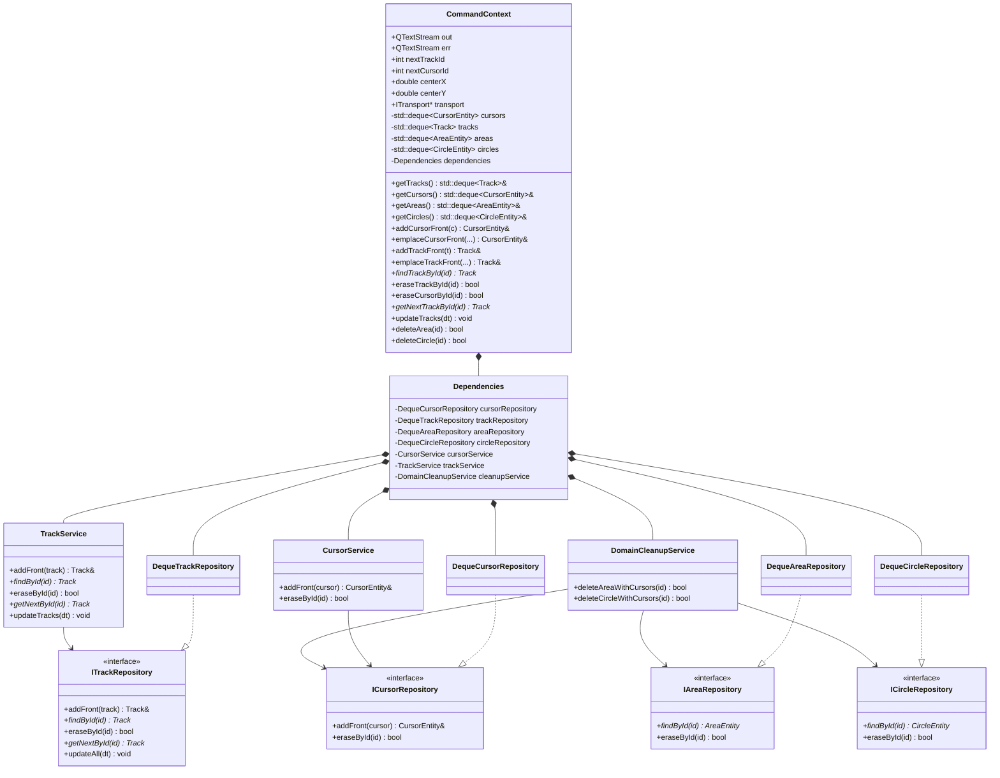

# Refactor de `CommandContext`: antes vs ahora

## Objetivo del refactor

Este refactor buscó reducir el acoplamiento del módulo de estado (`CommandContext`), separar responsabilidades por capas (repositorio/servicio) y preparar el código para evolución segura sin romper `main.cpp` ni `MessageRouter`.

---

## Estado **antes** del refactor

En el estado original, `CommandContext` funcionaba como un **objeto central monolítico**:

- Contenía estado de dominio (`tracks`, `cursors`, `areas`, `circles`).
- Exponía y permitía acceso directo a contenedores en múltiples consumidores.
- Implementaba lógica de negocio directamente (alta, búsqueda, borrado, cleanup cruzado).
- Mezclaba detalles de infraestructura, estado y reglas en una sola unidad.

### Problemas detectados

- **Alto acoplamiento**: comandos/encoders dependían de detalles internos de contenedores.
- **Baja cohesión**: una sola clase con demasiadas responsabilidades.
- **Dificultad de testeo**: reglas de negocio embebidas en el contexto.
- **Riesgo de regresiones**: cambios internos impactaban demasiados puntos.

---

## Estado **ahora** (después del refactor)

Se aplicó una estructura por capas conservando compatibilidad:

1. **Interfaces de repositorio** (`I*Repository`) para desacoplar acceso a datos.
2. **Implementaciones en memoria** (`Deque*Repository`) sobre `std::deque`.
3. **Servicios de dominio/aplicación** (`TrackService`, `CursorService`, `DomainCleanupService`).
4. **`CommandContext` como fachada de estado + orquestación**, delegando lógica en servicios.

### Cambios principales aplicados

- Se crearon interfaces:
  - `ICursorRepository`
  - `ITrackRepository`
  - `IAreaRepository`
  - `ICircleRepository`
- Se crearon implementaciones concretas:
  - `DequeCursorRepository`
  - `DequeTrackRepository`
  - `DequeAreaRepository`
  - `DequeCircleRepository`
- Se delegó lógica a servicios:
  - `CursorService` (alta/borrado de cursor)
  - `TrackService` (alta/búsqueda/borrado/siguiente/update)
  - `DomainCleanupService` (borrado cruzado de área/círculo + cursores vinculados)
- Se introdujo contenedor interno `Dependencies` en `CommandContext` para wiring persistente.
- Se encapsuló estado interno:
  - `tracks`, `cursors`, `areas`, `circles` son `private`.
  - acceso por `getTracks()`, `getCursors()`, `getAreas()`, `getCircles()` y métodos de dominio.
- Consumidores fueron migrados de acceso directo a API del contexto.

---

## ¿Por qué interfaces?

Se eligieron interfaces para aplicar **Dependency Inversion (DIP)**:

- El dominio depende de abstracciones (`ITrackRepository`), no de estructuras concretas (`std::deque`).
- Permite cambiar almacenamiento sin tocar servicios/consumidores.
- Facilita pruebas unitarias con dobles/mocks.
- Hace explícito el contrato por agregado (`Track`, `Cursor`, etc.).

---

## ¿Por qué un contenedor `Dependencies`?

Se creó `Dependencies` dentro de `CommandContext` para resolver dos problemas:

1. Evitar reinstanciar repositorios/servicios en cada método.
2. Centralizar el wiring entre deques, repos y servicios en un único punto.

Beneficios:

- Menor overhead de construcción repetida.
- Menos ruido en cada método del contexto.
- Mayor consistencia en la orquestación.

---

## ¿Por qué se usó `struct` y no `class`?

### `CommandContext` como `struct`

Se mantuvo `struct` por **compatibilidad incremental**:

- El módulo ya estaba integrado con múltiples consumidores.
- Mantener `struct` evitó un cambio disruptivo de API en esta fase.
- Se introdujo encapsulación de forma progresiva moviendo miembros críticos a `private`.

### `Dependencies` como `struct`

`Dependencies` se modeló como `struct` porque es un **agregado de wiring**:

- No representa una entidad de dominio.
- No tiene invariantes complejas ni comportamiento propio de negocio.
- Su propósito es contener dependencias conectadas en constructor.

> Decisión práctica: en este contexto, `struct` reduce fricción y mantiene legibilidad del wiring.

---

## Decisiones de diseño y su justificación

- **No usar señales Qt para lógica de dominio**:
  - Se prefirió DI + llamadas síncronas para trazabilidad y depuración.
  - Señales quedan mejor para eventos/integraciones, no para comandos core.
- **Refactor por fases (PR1..PR5)**:
  - Menor riesgo, cambios pequeños, reversibles y verificables.
- **Encapsulación gradual**:
  - Primero migrar consumidores a API, luego privatizar contenedores.
- **Mantener puntos de entrada estables**:
  - `main.cpp` y `MessageRouter` no se alteraron en comportamiento.

---

## Diagrama de clases (estado actual)

---

## Resultado

El módulo quedó más limpio y mantenible:

- Menos acoplamiento estructural.
- Responsabilidades separadas.
- Mayor encapsulación del estado.
- Camino claro para futuras mejoras (IDs, center state, metadatos de comandos) sin cambios disruptivos.
