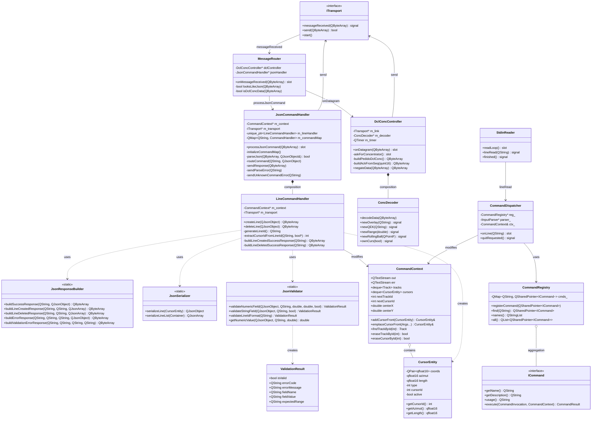
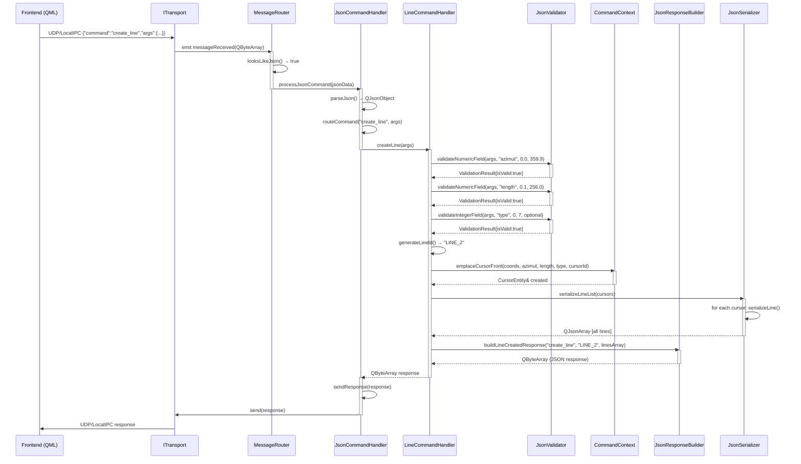
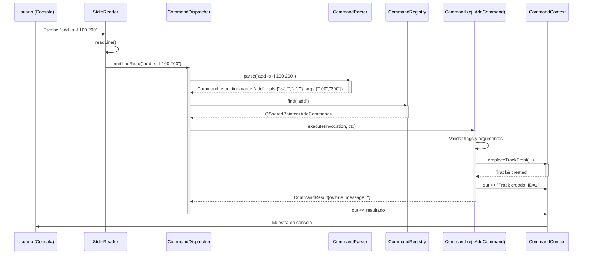
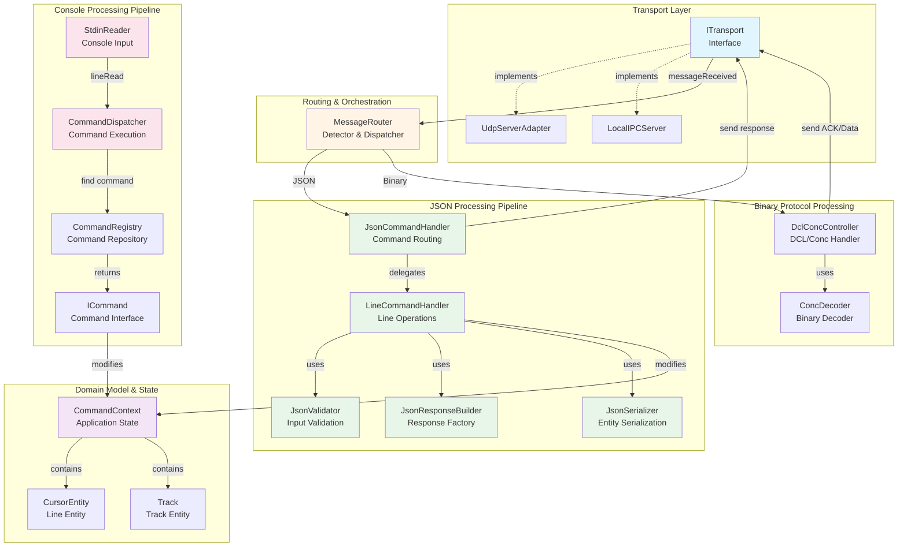

# Backend - Sistema de Procesamiento de Comandos y Mensajes

## Descripción General

El backend implementa una arquitectura modular que procesa múltiples tipos de mensajes entrantes (JSON, binarios del concentrador, etc.) y ejecuta comandos tanto desde el frontend como desde entrada de consola. El sistema separa claramente el enrutamiento, procesamiento, validación y ejecución de comandos.

## Arquitectura del Sistema

### Diagrama de Flujo Simplificado

```
┌──────────────────────────────────────┐
│         ITransport                   │
│   (UDP / LocalIPC Server)            │
│    Capa de Comunicación              │
└──────────┬───────────────────────────┘
           │ messageReceived(QByteArray)
           ▼
┌──────────────────────────────────────┐
│       MessageRouter                  │
│  • Detección automática del tipo    │
│  • Enrutamiento inteligente         │
│  • Sin lógica de negocio             │
└──┬────────────────┬──────────────────┘
   │                │
   │                └─► DCL/Concentrador Data
   │                     └─► DclConcController
   │                          • Decodifica datos binarios
   │                          • ACK/NACK
   │                          • Actualiza estado HW
   │
   └─► JSON Commands
        └─► JsonCommandHandler
            • Parseo JSON
            • Validación
            • Enrutamiento interno
            │
            ├─► LineCommandHandler
            │    • create_line
            │    • delete_line
            │    └─► JsonResponseBuilder
            │
            └─► [Futuros Handlers]
                 • TrackCommandHandler
                 • OverlayCommandHandler
                 • etc.

┌──────────────────────────────────────┐
│     Consola (STDIN)                  │
│    StdinReader → CommandDispatcher   │
└──────────┬───────────────────────────┘
           │
           ▼
   ┌───────────────────┐
   │ CommandRegistry   │
   │  • add            │
   │  • delete         │
   │  • center         │
   │  • list           │
   │  • addCursor      │
   │  • listcursors    │
   │  • deletecursors  │
   └───────┬───────────┘
           │
           ▼
   ┌───────────────────┐
   │ CommandContext    │
   │  • tracks         │
   │  • cursors        │
   │  • centerX/Y      │
   │  • nextTrackId    │
   │  • nextCursorId   │
   └───────────────────┘
```

### Diagrama de Clases UML (Mermaid)



### Diagrama de Secuencia - Crear Línea desde Frontend (Mermaid)



### Diagrama de Secuencia - Comando desde Consola (Mermaid)



### Diagrama de Componentes (Mermaid)



## Componentes del Sistema

### MessageRouter
**Responsabilidad:** Detectar el tipo de mensaje entrante y enrutar al controlador apropiado

**Métodos:**
```cpp
void onMessageReceived(const QByteArray& data) slot;
bool looksLikeJson(const QByteArray& data) const;
bool isDclConcData(const QByteArray& data) const;
```

**Comportamiento:**
- Si el mensaje comienza con `{` → Enruta a `JsonCommandHandler`
- Si tiene alta densidad de `0xFF` y formato DCL → Enruta a `DclConcController`
- Caso por defecto → Log de mensaje desconocido

### JsonCommandHandler
**Responsabilidad:** Parsear JSON, validar estructura y enrutar a handlers especializados

**Estructura del Mapa de Comandos:**
```cpp
QMap<QString, CommandHandler> m_commandMap;
// "create_line" → LineCommandHandler::createLine
// "delete_line" → LineCommandHandler::deleteLine
// ... futuros comandos
```

**Métodos principales:**
```cpp
void processJsonCommand(const QByteArray& jsonData) slot;
void initializeCommandMap();
bool parseJson(const QByteArray& jsonData, QJsonObject& outObject);
void routeCommand(const QString& command, const QJsonObject& args);
void sendResponse(const QByteArray& responseData);
```

**Flujo de procesamiento:**
1. Parsear JSON → `QJsonObject`
2. Extraer `command` y `args`
3. Buscar handler en `m_commandMap`
4. Ejecutar handler → obtener `QByteArray` response
5. Enviar respuesta via `ITransport`

### LineCommandHandler
**Responsabilidad:** Implementar operaciones CRUD sobre líneas (cursores)

**Métodos:**
```cpp
QByteArray createLine(const QJsonObject& args);
QByteArray deleteLine(const QJsonObject& args);
```

**Flujo de `createLine`:**
1. Validar `azimut` (0.0 - 359.9) obligatorio
2. Validar `length` (0.1 - 256.0) obligatorio
3. Validar `type` (0 - 7) opcional, default 0
4. Extraer `x`, `y` opcionales, default 0.0
5. Generar `lineId` secuencial (`LINE_N`)
6. Crear `CursorEntity` en `CommandContext`
7. Serializar todas las líneas
8. Construir respuesta de éxito con `JsonResponseBuilder`

**Flujo de `deleteLine`:**
1. Validar campo `id` presente
2. Validar formato `LINE_<número>`
3. Extraer `cursorId` del string
4. Eliminar cursor del contexto
5. Serializar líneas restantes
6. Construir respuesta (éxito o error `LINE_NOT_FOUND`)

### JsonResponseBuilder
**Responsabilidad:** Factory para construir respuestas JSON estandarizadas

**Métodos estáticos:**
```cpp
static QByteArray buildSuccessResponse(
    const QString& command,
    const QJsonObject& args
);

static QByteArray buildLineCreatedResponse(
    const QString& command,
    const QString& createdId,
    const QJsonArray& allLines
);

static QByteArray buildLineDeletedResponse(
    const QString& command,
    const QString& deletedId,
    const QJsonArray& remainingLines
);

static QByteArray buildErrorResponse(
    const QString& command,
    const QString& errorCode,
    const QString& errorMessage,
    const QJsonObject& details = QJsonObject()
);

static QByteArray buildValidationErrorResponse(
    const QString& command,
    const QString& fieldName,
    const QString& fieldValue,
    const QString& expectedRange
);
```

**Formato de respuesta estándar:**
```json
{
  "status": "success" | "error",
  "command": "<comando>",
  "args": { ... }
}
```

### JsonSerializer
**Responsabilidad:** Convertir entidades del dominio a JSON

**Métodos estáticos:**
```cpp
static QJsonObject serializeLine(const CursorEntity& cursor);

template <typename Container>
static QJsonArray serializeLineList(const Container& cursors);
```

**Formato de línea serializada:**
```json
{
  "id": "LINE_2",
  "azimut": 45.5,
  "length": 100.0,
  "x": 0.0,
  "y": 0.0,
  "type": 1
}
```

### JsonValidator
**Responsabilidad:** Validar campos JSON según reglas de negocio

**Estructura ValidationResult:**
```cpp
struct ValidationResult {
    bool isValid;
    QString errorCode;
    QString errorMessage;
    QString fieldName;
    QString fieldValue;
    QString expectedRange;
};
```

**Métodos principales:**
```cpp
static ValidationResult validateNumericField(
    const QJsonObject& args,
    const QString& fieldName,
    double minValue,
    double maxValue,
    bool required
);

static ValidationResult validateStringField(
    const QJsonObject& args,
    const QString& fieldName,
    bool required
);

static ValidationResult validateLineIdFormat(const QString& lineId);
```

### CommandContext
**Responsabilidad:** Mantener el estado global de la aplicación

**Datos principales:**
```cpp
std::deque<CursorEntity> cursors;  // Líneas (cursores)
std::deque<Track> tracks;          // Tracks (trazas)
int nextTrackId;                   // Generador de IDs para tracks
int nextCursorId;                  // Generador de IDs para líneas
double centerX, centerY;           // Centro de referencia
```

**Métodos de gestión:**
```cpp
CursorEntity& emplaceCursorFront(Args&&... args);
bool eraseCursorById(int id);
Track* findTrackById(int id);
bool eraseTrackById(int id);
QPointF center() const;
void setCenter(QPair<float,float> c);
```

### CommandRegistry & Console Commands
**Responsabilidad:** Registro y ejecución de comandos de consola

**Comandos disponibles:**
- `add` - Crear track con flags de identidad y tipo
- `delete` - Eliminar track por ID
- `center` - Establecer centro de referencia
- `list` - Listar todos los tracks
- `addCursor` - Crear línea desde consola
- `listcursors` - Listar todas las líneas
- `deletecursors` - Eliminar líneas por ID

**Interfaz ICommand:**
```cpp
virtual QString getName() const = 0;
virtual QString getDescription() const = 0;
virtual QString usage() const = 0;
virtual CommandResult execute(
    const CommandInvocation& inv,
    CommandContext& ctx
) const = 0;
```

### DclConcController
**Responsabilidad:** Procesar datos binarios del concentrador DCL

**Funciones principales:**
- Enviar peticiones periódicas al concentrador
- Decodificar datos binarios recibidos
- Enviar ACKs de confirmación
- Emitir señales para overlay, QEK, range, etc.

**Señales del decoder:**
```cpp
void newOverlay(const QString& overlayName);
void newQEK(const QString& qekStr);
void newRange(double range);
void newRollingBall(const QPointF& position);
void ownCurs(bool active);
```

## API de Comandos JSON

### Formato General

**Request:**
```json
{
  "command": "<nombre_comando>",
  "args": {
    // argumentos específicos
  }
}
```

**Response (Success):**
```json
{
  "status": "success",
  "command": "<nombre_comando>",
  "args": {
    // datos de respuesta
  }
}
```

**Response (Error):**
```json
{
  "status": "error",
  "command": "<nombre_comando>",
  "args": {
    "error_code": "CODIGO_ERROR",
    "message": "Descripción del error",
    "details": { /* info adicional */ }
  }
}
```

### Comando: create_line

**Propósito:** Crear una nueva línea en el sistema

**Request:**
```json
{
  "command": "create_line",
  "args": {
    "azimut": 45.0,      // Obligatorio: 0.0 - 359.9
    "length": 100.0,     // Obligatorio: 0.1 - 256.0
    "x": 0.0,            // Opcional, default 0.0
    "y": 0.0,            // Opcional, default 0.0
    "type": 1            // Opcional: 0-7, default 0
  }
}
```

**Response (Success):**
```json
{
  "status": "success",
  "command": "create_line",
  "args": {
    "created_id": "LINE_2",
    "lines": [
      {
        "id": "LINE_1",
        "azimut": 90.0,
        "length": 50.0,
        "x": 0.0,
        "y": 0.0,
        "type": 0
      },
      {
        "id": "LINE_2",
        "azimut": 45.0,
        "length": 100.0,
        "x": 0.0,
        "y": 0.0,
        "type": 1
      }
    ]
  }
}
```

**Response (Validation Error):**
```json
{
  "status": "error",
  "command": "create_line",
  "args": {
    "error_code": "VALIDATION_ERROR",
    "message": "Campo 'azimut' inválido: valor '400.0' fuera de rango [0.0 - 359.9]",
    "details": {
      "field": "azimut",
      "value": "400.0",
      "expected_range": "0.0 - 359.9"
    }
  }
}
```

**Códigos de error:**
- `VALIDATION_ERROR` - Campo con valor inválido
- `MISSING_FIELD` - Campo obligatorio ausente
- `BACKEND_ERROR` - Error interno al crear la línea

### Comando: delete_line

**Propósito:** Eliminar una línea existente

**Request:**
```json
{
  "command": "delete_line",
  "args": {
    "id": "LINE_2"
  }
}
```

**Response (Success):**
```json
{
  "status": "success",
  "command": "delete_line",
  "args": {
    "deleted_id": "LINE_2",
    "lines": [
      {
        "id": "LINE_1",
        "azimut": 90.0,
        "length": 50.0,
        "x": 0.0,
        "y": 0.0,
        "type": 0
      }
    ]
  }
}
```

**Response (Error - Línea no encontrada):**
```json
{
  "status": "error",
  "command": "delete_line",
  "args": {
    "error_code": "LINE_NOT_FOUND",
    "message": "Línea no encontrada: LINE_999",
    "details": {
      "id": "LINE_999"
    }
  }
}
```

**Response (Error - Formato inválido):**
```json
{
  "status": "error",
  "command": "delete_line",
  "args": {
    "error_code": "INVALID_ID_FORMAT",
    "message": "El ID debe tener formato 'LINE_<número>'",
    "details": {
      "id": "INVALID_ID",
      "expected_format": "LINE_<número>"
    }
  }
}
```

**Códigos de error:**
- `MISSING_FIELD` - Campo `id` ausente
- `INVALID_ID_FORMAT` - ID no cumple formato `LINE_<número>`
- `LINE_NOT_FOUND` - Línea con ese ID no existe
- `BACKEND_ERROR` - Error interno al eliminar

## Agregar Nuevos Comandos JSON

### Paso 1: Crear Handler Especializado (Opcional)

Si el comando pertenece a un dominio nuevo, crear un handler dedicado:

```cpp
// En src/controller/handlers/trackcommandhandler.h
#pragma once
#include <QJsonObject>
#include <QByteArray>

class CommandContext;
class ITransport;

class TrackCommandHandler
{
public:
    TrackCommandHandler(CommandContext* context, ITransport* transport);
    
    QByteArray createTrack(const QJsonObject& args);
    QByteArray deleteTrack(const QJsonObject& args);
    QByteArray listTracks(const QJsonObject& args);
    
private:
    CommandContext* m_context;
    ITransport* m_transport;
};
```

### Paso 2: Implementar Lógica del Handler

```cpp
// En src/controller/handlers/trackcommandhandler.cpp
#include "trackcommandhandler.h"
#include "../json/validators/jsonvalidator.h"
#include "../json/jsonresponsebuilder.h"
#include "../json/jsonserializer.h"
#include "commandContext.h"
#include "entities/track.h"

TrackCommandHandler::TrackCommandHandler(CommandContext* context, ITransport* transport)
    : m_context(context), m_transport(transport)
{
    Q_ASSERT(m_context);
    Q_ASSERT(m_transport);
}

QByteArray TrackCommandHandler::createTrack(const QJsonObject& args)
{
    // 1. Validar campos de entrada
    ValidationResult xValidation = JsonValidator::validateNumericField(
        args, "x", -1000.0, 1000.0, true
    );
    if (!xValidation.isValid) {
        return JsonResponseBuilder::buildValidationErrorResponse(
            "create_track",
            xValidation.fieldName,
            xValidation.fieldValue,
            xValidation.expectedRange
        );
    }
    
    ValidationResult yValidation = JsonValidator::validateNumericField(
        args, "y", -1000.0, 1000.0, true
    );
    if (!yValidation.isValid) {
        return JsonResponseBuilder::buildValidationErrorResponse(
            "create_track",
            yValidation.fieldName,
            yValidation.fieldValue,
            yValidation.expectedRange
        );
    }
    
    // 2. Extraer valores validados
    double x = JsonValidator::getNumericValue(args, "x");
    double y = JsonValidator::getNumericValue(args, "y");
    
    // 3. Crear entidad en el contexto
    try {
        int trackId = m_context->nextTrackId++;
        Track& newTrack = m_context->emplaceTrackFront(
            trackId,
            TrackData::Type::Friend,
            TrackData::Identity::System,
            x,
            y
        );
        
        // 4. Serializar respuesta
        QJsonObject responseArgs;
        responseArgs["created_id"] = trackId;
        // Agregar más datos si es necesario...
        
        return JsonResponseBuilder::buildSuccessResponse("create_track", responseArgs);
        
    } catch (const std::exception& e) {
        qWarning() << "[TrackCommandHandler] Error al crear track:" << e.what();
        return JsonResponseBuilder::buildErrorResponse(
            "create_track",
            "BACKEND_ERROR",
            QString("Error interno: %1").arg(e.what())
        );
    }
}
```

### Paso 3: Registrar en JsonCommandHandler

```cpp
// En src/controller/json/jsoncommandhandler.h
#include "../handlers/trackcommandhandler.h"

class JsonCommandHandler : public QObject
{
    // ...
private:
    std::unique_ptr<LineCommandHandler> m_lineHandler;
    std::unique_ptr<TrackCommandHandler> m_trackHandler;  // NUEVO
    // ...
};
```

```cpp
// En src/controller/json/jsoncommandhandler.cpp
JsonCommandHandler::JsonCommandHandler(CommandContext* context, ITransport* transport, QObject *parent)
    : QObject(parent), m_transport(transport)
{
    Q_ASSERT(context);
    Q_ASSERT(m_transport);
    
    m_lineHandler = std::make_unique<LineCommandHandler>(context, transport);
    m_trackHandler = std::make_unique<TrackCommandHandler>(context, transport); // NUEVO
    
    initializeCommandMap();
}

void JsonCommandHandler::initializeCommandMap()
{
    // Comandos existentes
    m_commandMap["create_line"] = [this](const QJsonObject& args) {
        return m_lineHandler->createLine(args);
    };
    
    m_commandMap["delete_line"] = [this](const QJsonObject& args) {
        return m_lineHandler->deleteLine(args);
    };
    
    // NUEVOS COMANDOS
    m_commandMap["create_track"] = [this](const QJsonObject& args) {
        return m_trackHandler->createTrack(args);
    };
    
    m_commandMap["delete_track"] = [this](const QJsonObject& args) {
        return m_trackHandler->deleteTrack(args);
    };
    
    m_commandMap["list_tracks"] = [this](const QJsonObject& args) {
        return m_trackHandler->listTracks(args);
    };
}
```

### Paso 4: Actualizar Build Configuration

```pro
# En DDM.pro, agregar nuevos archivos
HEADERS += \
    src/controller/handlers/trackcommandhandler.h \
    # ... otros headers

SOURCES += \
    src/controller/handlers/trackcommandhandler.cpp \
    # ... otros sources
```

### Paso 5: Testing

```cpp
// Ejemplo de test manual desde consola o script
// Request:
{
  "command": "create_track",
  "args": {
    "x": 150.5,
    "y": 200.0
  }
}

// Expected response:
{
  "status": "success",
  "command": "create_track",
  "args": {
    "created_id": 1
  }
}
```

## Agregar Nuevos Comandos de Consola

### Paso 1: Crear Clase de Comando

```cpp
// En src/controller/commands/mycommand.h
#pragma once
#include "iCommand.h"

class MyCommand : public ICommand {
public:
    QString getName() const override { return "mycommand"; }
    
    QString getDescription() const override {
        return "Descripción breve del comando";
    }
    
    QString usage() const override {
        return "mycommand [-flag] <arg1> <arg2>";
    }
    
    CommandResult execute(
        const CommandInvocation& inv,
        CommandContext& ctx
    ) const override;
};
```

### Paso 2: Implementar Lógica

```cpp
// En src/controller/commands/mycommand.cpp
#include "mycommand.h"
#include <QDebug>

CommandResult MyCommand::execute(
    const CommandInvocation& inv,
    CommandContext& ctx
) const {
    // 1. Validar argumentos
    if (inv.args.size() < 2) {
        ctx.err << "Error: se requieren 2 argumentos\n";
        ctx.err << "Uso: " << usage() << "\n";
        ctx.err.flush();
        return {false, "Argumentos insuficientes"};
    }
    
    // 2. Extraer valores
    QString arg1 = inv.args[0];
    QString arg2 = inv.args[1];
    bool hasFlag = inv.opts.contains("-flag");
    
    // 3. Ejecutar lógica
    // ... operación sobre ctx
    
    // 4. Reportar resultado
    ctx.out << "Comando ejecutado exitosamente\n";
    ctx.out.flush();
    
    return {true, ""};
}
```

### Paso 3: Registrar en main.cpp

```cpp
// En src/main.cpp
#include "mycommand.h"

int main(int argc, char* argv[]) {
    // ...
    
    registry->registerCommand(QSharedPointer<ICommand>(new AddCommand()));
    registry->registerCommand(QSharedPointer<ICommand>(new DeleteCommand()));
    // ... otros comandos
    registry->registerCommand(QSharedPointer<ICommand>(new MyCommand())); // NUEVO
    
    // ...
}
```

## Algoritmo de Detección de Mensajes

El `MessageRouter` implementa detección heurística del tipo de mensaje:

```cpp
void MessageRouter::onMessageReceived(const QByteArray& data)
{
    if (looksLikeJson(data)) {
        // Caso más común (comandos desde frontend)
        m_jsonHandler->processJsonCommand(data);
    }
    else if (isDclConcData(data)) {
        // Datos binarios del concentrador
        m_dclController->onDatagram(data);
    }
    else {
        qWarning() << "[MessageRouter] Mensaje no reconocido, tamaño:" << data.size();
    }
}

bool MessageRouter::looksLikeJson(const QByteArray& data) const
{
    // JSON siempre empieza con '{'
    return !data.isEmpty() && data[0] == '{';
}

bool MessageRouter::isDclConcData(const QByteArray& data) const
{
    if (data.size() < 10) return false;
    
    // Datos DCL tienen alta densidad de 0xFF
    int ffCount = 0;
    for (int i = 0; i < qMin(data.size(), 50); ++i) {
        if (static_cast<unsigned char>(data[i]) == 0xFF) {
            ++ffCount;
        }
    }
    
    // Si > 30% son 0xFF, probablemente es DCL
    return (ffCount * 100 / qMin(data.size(), 50)) > 30;
}
```

**Complejidad:**
- `looksLikeJson()`: O(1) - solo verifica primer byte
- `isDclConcData()`: O(n) donde n ≤ 50 bytes

## Flujo de Inicialización

El archivo `main.cpp` orquesta la inicialización completa del sistema:

```cpp
int main(int argc, char* argv[]) {
    QCoreApplication app(argc, argv);
    
    // 1. Crear contexto compartido
    auto* ctx = new CommandContext();
    
    // 2. Configurar comandos de consola
    auto* registry = new CommandRegistry();
    auto* parser = new CommandParser();
    registry->registerCommand(...); // todos los comandos
    CommandDispatcher dispatcher(registry, parser, *ctx);
    
    // 3. Configurar lectura de stdin en thread separado
    QThread ioThread;
    StdinReader reader;
    reader.moveToThread(&ioThread);
    QObject::connect(&ioThread, &QThread::started, &reader, &StdinReader::readLoop);
    QObject::connect(&reader, &StdinReader::lineRead, &dispatcher, &CommandDispatcher::onLine);
    
    // 4. Configurar transporte (UDP o LocalIPC)
    bool useLocalIpc = Configuration::instance().useLocalIpc;
    std::unique_ptr<ITransport> transport = useLocalIpc
        ? makeTransport(TransportKind::LocalIpc, opts, &app)
        : makeTransport(TransportKind::Udp, opts, &app);
    transport->start();
    
    // 5. Crear controladores
    auto* decoder = new ConcDecoder();
    auto* dclConcController = new DclConcController(transport.get(), decoder, &app);
    auto* jsonHandler = new JsonCommandHandler(ctx, transport.get(), &app);
    
    // 6. Crear router y conectar
    auto* router = new MessageRouter(dclConcController, jsonHandler, &app);
    QObject::connect(transport.get(), &ITransport::messageReceived,
                     router, &MessageRouter::onMessageReceived);
    
    // 7. Configurar encoder LPD y timer de envío
    encoderLPD *encoder = new encoderLPD();
    QTimer timer;
    QObject::connect(&timer, &QTimer::timeout, [ctx, encoder, transport]() {
        transport->send(encoder->buildFullMessage(*ctx));
    });
    timer.start(40); // 25 Hz
    
    // 8. Configurar handlers adicionales (OBM, Overlay, etc.)
    // ...
    
    // 9. Iniciar threads y event loop
    ioThread.start();
    const int code = app.exec();
    ioThread.wait();
    return code;
}
```

## Características del Sistema

### Separación de Responsabilidades (SOLID)

**Single Responsibility:**
- `MessageRouter` → Solo detecta y enruta
- `JsonCommandHandler` → Solo parsea y delega JSON
- `LineCommandHandler` → Solo operaciones de líneas
- `JsonResponseBuilder` → Solo construye respuestas
- `JsonValidator` → Solo valida entradas
- `JsonSerializer` → Solo serializa entidades

**Open/Closed Principle:**
- Agregar nuevos comandos JSON: extender `initializeCommandMap()`
- Agregar nuevos handlers: crear clase y registrar
- Agregar nuevos comandos consola: implementar `ICommand` y registrar

**Dependency Inversion:**
- Controladores dependen de `ITransport` (abstracción)
- Handlers reciben `CommandContext*` (inyección)
- No hay dependencias concretas hardcodeadas

### Validación Robusta

Todas las entradas JSON pasan por validación antes de ejecución:
- Validación de tipos (numeric, string, integer)
- Validación de rangos (min/max values)
- Validación de formatos (IDs, enums)
- Campos obligatorios vs opcionales
- Mensajes de error estructurados

### Serialización Consistente

Toda la serialización JSON está centralizada:
- `JsonSerializer` convierte entidades a JSON
- `JsonResponseBuilder` construye respuestas estandarizadas
- Formato único para success/error responses
- Fácil de mantener y testear

### Threading Strategy

- **Main Thread:** Event loop, timers, controladores, network I/O
- **I/O Thread:** Lectura bloqueante de stdin (no bloquea main thread)
- **Signals/Slots:** Comunicación thread-safe entre threads

### Performance

- Detección de JSON: O(1) en caso común
- Validación: O(1) por campo
- Serialización: O(n) donde n = número de entidades
- Sin parsing especulativo (solo JSON válido se procesa)

## Estructura de Archivos

### Controllers
```
src/controller/
├── commandDispatcher.h/cpp       # Despachador de comandos consola
├── commandRegistry.h             # Registro de comandos (header-only)
├── dclConcController.h/cpp       # Controlador datos concentrador
├── messagerouter.h/cpp           # Router principal de mensajes
├── overlayHandler.h/cpp          # Handler de overlays
├── commands/                     # Comandos de consola
│   ├── iCommand.h                # Interface de comando
│   ├── addCommand.h/cpp
│   ├── deleteCommand.h/cpp
│   ├── centerCommand.h/cpp
│   ├── listCommand.h/cpp
│   ├── addCursor.h/cpp
│   ├── listcursorscommand.h/cpp
│   └── deletecursorscommand.h/cpp
├── handlers/                     # Handlers especializados
│   └── linecommandhandler.h/cpp
└── json/                         # Módulo JSON
    ├── jsoncommandhandler.h/cpp
    ├── jsonresponsebuilder.h/cpp
    ├── jsonserializer.h/cpp
    └── validators/
        └── jsonvalidator.h/cpp
```

### Model
```
src/model/
├── commandContext.h              # Estado global aplicación
├── entities/
│   ├── cursorEntity.h/cpp        # Entidad línea/cursor
│   └── track.h/cpp               # Entidad track/traza
├── decoders/
│   ├── concDecoder.h/cpp         # Decoder DCL/Concentrador
│   └── lpdEncoder.h/cpp          # Encoder LPD
└── network/
    ├── iTransport.h              # Interface transporte
    └── ...                       # Implementaciones
```

### View
```
src/view/
├── stdinreader.h/cpp             # Lector async de consola
├── commandParser.h               # Parser de comandos consola
└── iInputParser.h                # Interface parser
```

## Testing y Debugging

### Logs del Sistema

```cpp
// Niveles de log
qDebug()   // Información detallada de flujo
qInfo()    // Eventos importantes
qWarning() // Situaciones inesperadas pero manejables
qCritical() // Errores graves
```

### Ejemplos de logs

```
[MessageRouter] Mensaje JSON recibido, tamaño: 87 bytes
[JsonCommandHandler] Procesando comando: create_line
[LineCommandHandler] Validando campos...
[LineCommandHandler] Línea creada ID: LINE_2
[LineCommandHandler] Respuesta exitosa con 2 líneas
```

### Test Manual - Crear Línea

**Enviar desde frontend:**
```bash
echo '{"command":"create_line","args":{"azimut":45.0,"length":100.0}}' | nc -u localhost 7777
```

**Respuesta esperada:**
```json
{
  "status":"success",
  "command":"create_line",
  "args":{
    "created_id":"LINE_2",
    "lines":[...]
  }
}
```

### Test Manual - Comando Consola

**En consola del backend:**
```
> addCursor 45.0 100.0
Cursor creado con ID: 2, Azimut: 45.0, Largo: 100.0

> listcursors
=== Lista de Cursores ===
ID: 2, Azimut: 45.0°, Largo: 100.0, Pos: (0.0, 0.0), Tipo: 0, Activo: Sí
```

### Debugging Tips

**Ver mensajes entrantes:**
```cpp
// En messageRouter.cpp
void MessageRouter::onMessageReceived(const QByteArray& data) {
    qDebug() << "[MessageRouter] Recibido:" << data.toHex();
    qDebug() << "[MessageRouter] ASCII:" << data;
    // ...
}
```

**Ver comandos JSON:**
```cpp
// En jsoncommandhandler.cpp
void JsonCommandHandler::routeCommand(const QString& command, const QJsonObject& args) {
    qDebug() << "[JsonCommandHandler] Command:" << command;
    qDebug() << "[JsonCommandHandler] Args:" << QJsonDocument(args).toJson(QJsonDocument::Compact);
    // ...
}
```

**Ver validaciones:**
```cpp
// En linecommandhandler.cpp
if (!azimutValidation.isValid) {
    qWarning() << "[Validation] Azimut inválido:"
               << azimutValidation.fieldValue
               << "esperado:" << azimutValidation.expectedRange;
    // ...
}
```

## Comparación Frontend vs Backend

| Aspecto | Frontend (DDMController) | Backend (JsonCommandHandler) |
|---------|--------------------------|------------------------------|
| **Rol** | Cliente - Envía comandos | Servidor - Procesa comandos |
| **Command Builder** | `JsonCommandBuilder` | N/A - Recibe JSON ya construido |
| **Response Parser** | `JsonResponseParser` | N/A - Construye respuestas |
| **Response Builder** | N/A - Recibe respuestas | `JsonResponseBuilder` |
| **Validación** | Opcional (UI puede validar) | Obligatoria (backend valida todo) |
| **Estado** | Propiedades Q_PROPERTY | `CommandContext` |
| **Señales** | `lineCreated`, `lineDeleted` | N/A - Solo responde |
| **Transport** | Envía comandos | Envía respuestas |

## Extensibilidad Futura

### Agregar WebSocket Support

```cpp
// Crear nuevo transport
class WebSocketTransport : public ITransport {
    // Implementar interface
};

// En main.cpp, agregar opción de configuración
std::unique_ptr<ITransport> transport = 
    Configuration::instance().useWebSocket
        ? makeTransport(TransportKind::WebSocket, opts, &app)
        : makeTransport(TransportKind::Udp, opts, &app);
```

### Agregar Persistencia

```cpp
// Crear handler de persistencia
class PersistenceHandler {
public:
    void saveState(const CommandContext& ctx);
    void loadState(CommandContext& ctx);
};

// Conectar a eventos de cambio
QObject::connect(lineHandler, &LineCommandHandler::lineCreated,
                 persistenceHandler, &PersistenceHandler::saveState);
```

### Agregar Autenticación

```cpp
// Middleware de autenticación
class AuthMiddleware {
public:
    bool validateToken(const QString& token);
};

// En JsonCommandHandler::processJsonCommand
QJsonObject obj = parseJson(jsonData);
QString token = obj.value("token").toString();
if (!m_authMiddleware->validateToken(token)) {
    sendResponse(JsonResponseBuilder::buildErrorResponse(
        "unknown", "UNAUTHORIZED", "Token inválido"
    ));
    return;
}
```

## Referencias y Recursos

- **Especificación de protocolo:** `docs/DDM_BACKEND_INTERFACE.md`
- **Frontend counterpart:** `docs/README_MESSAGE_ROUTER.md`
- **Configuración Qt:** `DDM.pro`
- **Punto de entrada:** `src/main.cpp`
- **Decodificador DCL:** `src/model/decoders/concDecoder.h/cpp`
- **Encoder LPD:** `src/model/decoders/lpdEncoder.h/cpp`

## Resumen de Principios Aplicados

### Modularidad
Cada componente tiene una responsabilidad clara y puede ser testeado de forma aislada:
- Router: detección y enrutamiento
- Handlers: lógica de negocio específica
- Builders: construcción de respuestas
- Validators: validación de entradas
- Serializers: conversión a JSON

### Escalabilidad
Sistema diseñado para crecer sin modificar código existente:
- Agregar comandos: registrar en mapa
- Agregar handlers: crear clase y conectar
- Agregar validaciones: extender `JsonValidator`
- Agregar entidades: implementar serialización

### Mantenibilidad
Código organizado, documentado y con patrones consistentes:
- Nombres descriptivos y convenciones claras
- Separación de capas (controller/model/view)
- Logging estructurado para debugging
- Manejo de errores robusto

### Testabilidad
Arquitectura facilita testing unitario y de integración:
- Interfaces bien definidas (`ITransport`, `ICommand`)
- Inyección de dependencias explícita
- Estado centralizado en `CommandContext`
- Respuestas y validaciones fáciles de verificar
