# Backend - Sistema de Procesamiento de Comandos y Mensajes

## Descripción General

El backend implementa una arquitectura modular que procesa múltiples tipos de mensajes entrantes (JSON, binarios del concentrador DCL, etc.) y ejecuta comandos tanto desde el frontend como desde la consola.

El sistema separa claramente:

- Enrutamiento
- Parseo
- Validación
- Lógica de negocio
- Serialización
- Estado global

La arquitectura sigue principios SOLID y está organizada por responsabilidades funcionales.

---

## Estructura Real del Proyecto (`src/`)

```mermaid
graph TD

    %% ROOT
    SRC[src/]

    %% CONTROLLER
    CTRL[controller/]
    SRC --> CTRL

    ROUT[routing/]
    CTRL --> ROUT
    ROUT --> MR[messageRouter.*]

    JSON[json/]
    CTRL --> JSON
    JSON --> JCH[jsoncommandhandler.*]
    JSON --> JRB[jsonresponsebuilder.*]
    JSON --> JS[jsonserializer.*]
    JSON --> VAL[validators/]
    VAL --> JV[jsonvalidator.*]

    HANDLERS[handlers/]
    CTRL --> HANDLERS
    HANDLERS --> LCH[linecommandhandler.*]

    COMMANDS[commands/]
    CTRL --> COMMANDS
    COMMANDS --> ICMD[iCommand.h]
    COMMANDS --> ADD[addCommand.*]
    COMMANDS --> DEL[deleteCommand.*]
    COMMANDS --> CENTER[centerCommand.*]
    COMMANDS --> LIST[listCommand.*]
    COMMANDS --> ADDC[addCursor.*]
    COMMANDS --> LISTC[listcursorscommand.*]
    COMMANDS --> DELC[deletecursorscommand.*]

    CTRL --> DCL[dclConcController.*]
    CTRL --> DISP[commandDispatcher.*]
    CTRL --> REG[commandRegistry.h]

    %% MODEL
    MODEL[model/]
    SRC --> MODEL

    MODEL --> CTX[commandContext.h]

    ENT[entities/]
    MODEL --> ENT
    ENT --> CUR[cursorEntity.*]
    ENT --> TRK[track.*]

    DEC[decoders/]
    MODEL --> DEC
    DEC --> CONC[concDecoder.*]
    DEC --> LPD[lpdEncoder.*]

    NET[network/]
    MODEL --> NET
    NET --> ITRANS[iTransport.h]

    %% VIEW
    VIEW[view/]
    SRC --> VIEW
    VIEW --> STDIN[stdinreader.*]
    VIEW --> PARSER[commandParser.h]
    VIEW --> IINPUT[iInputParser.h]
```




---

## Arquitectura General

### 1️⃣ Routing Layer

Ubicación:
```
src/controller/routing/messageRouter.*
```

Responsabilidad:

- Detectar tipo de mensaje
- Enrutar al controlador correspondiente

Ejemplo:

```cpp
void MessageRouter::onMessageReceived(const QByteArray& data)
{
    if (looksLikeJson(data))
        m_jsonHandler->processJsonCommand(data);
    else if (isDclConcData(data))
        m_dclController->onDatagram(data);
    else
        qWarning() << "Mensaje no reconocido";
}
```

---

### 2️⃣ Pipeline JSON

Ubicación:
```
src/controller/json/
```

Componentes:

| Clase | Responsabilidad |
|--------|----------------|
| JsonCommandHandler | Parseo y dispatch |
| LineCommandHandler | Lógica de líneas |
| JsonValidator | Validación |
| JsonSerializer | Serialización |
| JsonResponseBuilder | Construcción de respuestas |

---

### 2.1 JsonCommandHandler

Flujo interno:

```cpp
void JsonCommandHandler::processJsonCommand(const QByteArray& jsonData)
{
    // 1. Parsear JSON
    // 2. Extraer "command"
    // 3. Buscar handler en m_commandMap
    // 4. Ejecutar handler
    // 5. Enviar respuesta
}
```

Mapa actual:

```cpp
m_commandMap["create_line"];
m_commandMap["delete_line"];
```

---

### 2.2 LineCommandHandler

Ubicación:
```
src/controller/handlers/linecommandhandler.*
```

Métodos:

```cpp
QByteArray createLine(const QJsonObject& args);
QByteArray deleteLine(const QJsonObject& args);
```

Flujo create_line:

1. Validar azimut (0.0 – 359.9)
2. Validar length (0.1 – 256.0)
3. Crear CursorEntity
4. Serializar
5. Construir respuesta

---

## 3️⃣ Estado Global — CommandContext

Ubicación:
```
src/model/commandContext.h
```

Contiene:

```cpp
std::deque<CursorEntity> cursors;
std::deque<Track> tracks;

int nextTrackId;
int nextCursorId;

double centerX;
double centerY;
```

Funciones principales:

```cpp
emplaceCursorFront(...)
eraseCursorById(...)
findTrackById(...)
eraseTrackById(...)
```

Es el núcleo del estado del backend.

---

## 4️⃣ Consola (STDIN)

Pipeline:

```text
STDIN
  ↓
StdinReader
  ↓
CommandDispatcher
  ↓
CommandRegistry
  ↓
ICommand
  ↓
CommandContext
```

Comandos actuales:

- add
- delete
- center
- list
- addCursor
- listcursors
- deletecursors

Interfaz base:

```cpp
class ICommand {
public:
    virtual QString getName() const = 0;
    virtual QString usage() const = 0;
    virtual CommandResult execute(...) = 0;
};
```

---

## 5️⃣ Procesamiento Binario (DCL)

### DclConcController

Ubicación:
```
src/controller/dclConcController.*
```

Responsabilidad:

- Recibir datos DCL
- Decodificar con ConcDecoder
- Enviar ACK
- Emitir señales

### ConcDecoder

Ubicación:
```
src/model/decoders/concDecoder.*
```

Señales:

```cpp
void newOverlay(QString);
void newQEK(QString);
void newRange(double);
void newRollingBall(QPointF);
void ownCurs(bool);
```

---

## Flujo Completo JSON

```text
Frontend
  ↓
ITransport
  ↓
MessageRouter
  ↓
JsonCommandHandler
  ↓
LineCommandHandler
  ↓
CommandContext
  ↓
JsonResponseBuilder
  ↓
ITransport
```

---

## API JSON

### Request

```json
{
  "command": "create_line",
  "args": {
    "azimut": 45.0,
    "length": 100.0,
    "x": 0.0,
    "y": 0.0,
    "type": 1
  }
}
```

### Response Success

```json
{
  "status": "success",
  "command": "create_line",
  "args": {
    "created_id": "LINE_2",
    "lines": []
  }
}
```

### Response Error

```json
{
  "status": "error",
  "command": "create_line",
  "args": {
    "error_code": "VALIDATION_ERROR",
    "message": "Campo inválido"
  }
}
```

---

## Principios de Diseño Aplicados

### Single Responsibility
Cada clase tiene una responsabilidad clara.

### Open / Closed
Agregar comandos no requiere modificar lógica existente.

### Dependency Inversion
Dependencias sobre interfaces:
- ITransport
- ICommand
- CommandContext

---

## Threading Strategy

- Main Thread → Event loop + red
- IO Thread → lectura bloqueante de consola
- Comunicación → signals/slots

---

## Ventajas de la Arquitectura Actual

✔ Modular  
✔ Escalable  
✔ Testeable  
✔ Desacoplado  
✔ Preparado para nuevos módulos (PPP, EST, SITREP, Figuras)

---

## Resumen Final

El backend actual implementa una arquitectura limpia donde:

- MessageRouter detecta
- JsonCommandHandler enruta
- Handlers ejecutan lógica
- CommandContext mantiene estado
- JsonResponseBuilder construye respuestas
- Consola y frontend conviven sin interferir

La estructura está lista para extender nuevas herramientas tácticas sin romper el sistema existente.
