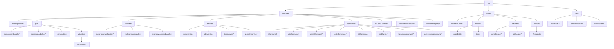

# Backend - Sistema de Procesamiento de Comandos y Mensajes

## Descripción General

El backend implementa una arquitectura modular que procesa múltiples tipos de mensajes entrantes (JSON, binarios del concentrador DCL, etc.) y ejecuta comandos tanto desde el frontend como desde la consola.

El sistema separa claramente:

- Enrutamiento
- Parseo
- Validación
- Lógica de negocio
- Serialización
- Estado global

La arquitectura sigue principios SOLID y está organizada por responsabilidades funcionales.

---

## Estructura Real del Proyecto (`src/`)


```mermaid
graph TD

    %% ROOT
    SRC[src/]

    %% CONTROLLER
    CTRL[controller/]
    SRC --> CTRL

    MR[messageRouter.*]
    CTRL --> MR

    JSON[json/]
    CTRL --> JSON
    JSON --> JCH[jsoncommandhandler.*]
    JSON --> JRB[jsonresponsebuilder.*]
    JSON --> JS[jsonserializer.*]
    JSON --> VAL[validators/]
    VAL --> JV[jsonvalidator.*]

    HANDLERS[handlers/]
    CTRL --> HANDLERS
    HANDLERS --> CCH[cursorcommandhandler.*]
    HANDLERS --> TCH[trackcommandhandler.*]
    HANDLERS --> GCH[geometrycommandhandler.*]

    SERVICES[services/]
    CTRL --> SERVICES
    SERVICES --> CS[cursorservice.*]
    SERVICES --> OS[obmservice.*]
    SERVICES --> TS[trackservice.*]
    SERVICES --> GS[geometryservice.*]

    COMMANDS[commands/]
    CTRL --> COMMANDS
    COMMANDS --> ICMD[iCommand.h]
    COMMANDS --> ADD[addCommand.*]
    COMMANDS --> DEL[deleteCommand.*]
    COMMANDS --> CENTER[centerCommand.*]
    COMMANDS --> LIST[listCommand.*]
    COMMANDS --> ADDC[addCursor.*]
    COMMANDS --> LISTC[listcursorscommand.*]
    COMMANDS --> DELC[deletecursorscommand.*]

    CTRL --> DCL[dclConcController.*]
    CTRL --> DISP[commandDispatcher.*]
    CTRL --> REG[commandRegistry.h]

    %% MODEL
    MODEL[model/]
    SRC --> MODEL

    MODEL --> CTX[commandContext.h]

    ENT[entities/]
    MODEL --> ENT
    ENT --> CUR[cursorEntity.*]
    ENT --> TRK[track.*]

    DEC[decoders/]
    MODEL --> DEC
    DEC --> CONC[concDecoder.*]
    DEC --> LPD[lpdEncoder.*]

    NET[network/]
    MODEL --> NET
    NET --> ITRANS[iTransport.h]

    %% VIEW
    VIEW[view/]
    SRC --> VIEW
    VIEW --> STDIN[stdinreader.*]
    VIEW --> PARSER[commandParser.h]
    VIEW --> IINPUT[iInputParser.h]
```


---

## Arquitectura General

### 1️⃣ Routing Layer

Ubicación:
```
src/controller/messagerouter.*
```

Responsabilidad:

- Detectar tipo de mensaje
- Enrutar al controlador correspondiente

Ejemplo:

```cpp
void MessageRouter::onMessageReceived(const QByteArray& data)
{
    if (looksLikeJson(data))
        m_jsonHandler->processJsonCommand(data);
    else if (isDclConcData(data))
        m_dclController->onDatagram(data);
    else
        qWarning() << "Mensaje no reconocido";
}
```

---

### 2️⃣ Pipeline JSON

Ubicación:
```
src/controller/json/
```

Componentes:

| Clase | Responsabilidad |
|--------|----------------|
| JsonCommandHandler | Parseo y dispatch |
| CursorCommandHandler | Adaptador JSON para line/cursor |
| TrackCommandHandler | Adaptador JSON para tracks |
| GeometryCommandHandler | Adaptador JSON para area/circle/polygon |
| CursorService | Lógica compartida de cursor (CLI+JSON) |
| ObmService | Lectura del estado actual de OBM para lógica de líneas |
| TrackService | Lógica compartida de tracks (CLI+JSON) |
| GeometryService | Lógica compartida de figuras (CLI+JSON) |
| JsonValidator | Validación |
| JsonSerializer | Serialización |
| JsonResponseBuilder | Construcción de respuestas |

---

### 2.1 JsonCommandHandler

Flujo interno:

```cpp
void JsonCommandHandler::processJsonCommand(const QByteArray& jsonData)
{
    // 1. Parsear JSON
    // 2. Extraer "command"
    // 3. Buscar handler en m_commandMap
    // 4. Ejecutar handler
    // 5. Enviar respuesta
}
```

Mapa actual:

```cpp
m_commandMap["create_line"];
m_commandMap["delete_line"];
m_commandMap["list_lines"];
m_commandMap["create_track"];
m_commandMap["delete_track"];
m_commandMap["list_tracks"];
m_commandMap["create_area"];
m_commandMap["delete_area"];
m_commandMap["create_circle"];
m_commandMap["delete_circle"];
m_commandMap["create_polygon"];
m_commandMap["delete_polygon"];
m_commandMap["list_shapes"];
m_commandMap["ownship_update"];
m_commandMap["cpa_start"];
m_commandMap["ppp_graph"];
m_commandMap["ppp_finish"];
m_commandMap["ppp_clear_track"];
```

Comando `ownship_update`:

- Recibe estado de buque propio desde AR-TDC via JSON.
- Delega en `OwnShipCommandHandler` + `OwnShipService`.
- Persiste en `CommandContext::ownShip`.

---

### 2.2 Cursor/Track/Geometry Handlers

Ubicación:
```
src/controller/handlers/cursorcommandhandler.*
src/controller/handlers/trackcommandhandler.*
src/controller/handlers/geometrycommandhandler.*
src/controller/services/*.cpp
```

Responsabilidad:

```cpp
// Handler: parseo + respuesta JSON
QByteArray createLine(const QJsonObject& args);

// Service: lógica de negocio compartida (CLI y JSON)
CursorOperationResult createCursor(const CursorCreateRequest& request);
```

Flujo refactorizado:

1. Adaptador (CLI/JSON) parsea y valida formato
2. Service ejecuta reglas de negocio y muta CommandContext
3. Adaptador construye salida (texto CLI o JSON)

---

## 3️⃣ Estado Global — CommandContext

Ubicación:
```
src/model/commandContext.h
```

Contiene:

```cpp
std::deque<CursorEntity> cursors;
std::deque<Track> tracks;
std::deque<AreaEntity> areas;
std::deque<CircleEntity> circles;
std::deque<PolygonoEntity> polygons;

int nextTrackId;
int nextCursorId;

double centerX;
double centerY;
```

Funciones principales:

```cpp
emplaceCursorFront(...)
eraseCursorById(...)
findTrackById(...)
eraseTrackById(...)
addArea(...)
deleteAreaById(...)
addCircle(...)
deleteCircleById(...)
addPolygono(...)
deletePolygonoById(...)
```

Es el núcleo del estado del backend.

Además incluye estado de buque propio:

```cpp
OwnShipState ownShip;
```

Campos relevantes de `OwnShipState`:

- `xDm`, `yDm`
- `latitudeDeg`, `longitudeDeg`
- `courseDeg`, `speedKnots`
- `timeUtc`, `dateUtc`, `source`, `valid`

---

## 4️⃣ Comandos CLI de OwnShip

Comando:

```text
ownship [show]
ownship set <course_deg> <speed_knots> [source]
```

Implementación:

- `src/controller/commands/ownshipcommand.*`
- Usa `OwnShipService` para que CLI y JSON compartan validaciones y persistencia.

---

## 4️⃣ Consola (STDIN)

Pipeline:

```text
STDIN
  ↓
StdinReader
  ↓
CommandDispatcher
  ↓
CommandRegistry
  ↓
ICommand
  ↓
CommandContext
```

Comandos actuales:

- add
- delete
- center
- list
- addCursor
- listcursors
- deletecursors
- ownship
- sitrep
- cpa
- estacionamiento
- display

Interfaz base:

```cpp
class ICommand {
public:
    virtual QString getName() const = 0;
    virtual QString usage() const = 0;
    virtual CommandResult execute(...) = 0;
};
```

---

## 5️⃣ Procesamiento Binario (DCL)

### DclConcController

Ubicación:
```
src/controller/dclConcController.*
```

Responsabilidad:

- Recibir datos DCL
- Decodificar con ConcDecoder
- Enviar ACK
- Emitir señales

### ConcDecoder

Ubicación:
```
src/model/decoders/concDecoder.*
```

Señales:

```cpp
void newOverlay(QString);
void newQEK(QString);
void newRange(double);
void newRollingBall(QPointF);
void ownCurs(bool);
```

---

## Flujo Completo JSON

```text
Frontend
  ↓
ITransport
  ↓
MessageRouter
  ↓
JsonCommandHandler
  ↓
CursorCommandHandler / TrackCommandHandler / GeometryCommandHandler
  ↓
Services (CursorService / ObmService / TrackService / GeometryService)
  ↓
CommandContext
  ↓
JsonResponseBuilder
  ↓
ITransport
```

---

## API JSON

### Request

```json
{
  "command": "create_track",
  "args": {
    "x": 0.0,
    "y": 0.0,
    "type": "SPC",
    "creation_environment": "SPC"
  }
}
```

### Response Success

```json
{
  "status": "success",
  "command": "create_line",
  "args": {
    "created_id": "LINE_2",
    "lines": []
  }
}
```

### Response Error

```json
{
  "status": "error",
  "command": "create_line",
  "args": {
    "error_code": "VALIDATION_ERROR",
    "message": "Campo inválido"
  }
}
```

### Request de listado de figuras

```json
{
  "command": "list_shapes",
  "args": {}
}
```

### Response Success de figuras

```json
{
  "status": "success",
  "command": "list_shapes",
  "args": {
    "areas": [],
    "circles": [],
    "polygons": []
  }
}
```

### Contratos JSON (resumen operativo)

| Command | Args requeridos | Respuesta success (args) |
|--------|------------------|--------------------------|
| `create_line` | `azimut`, `length` | `created_id`, `lines` |
| `delete_line` | `id` | `deleted_id`, `lines` |
| `list_lines` | ninguno | `lines` |
| `create_track` | `x`, `y` | `created_id`, `tracks` |
| `delete_track` | `id` | `deleted_id`, `tracks` |
| `list_tracks` | ninguno | `tracks` |
| `create_area` | `points` | `created_id`, `areas` |
| `delete_area` | `id` | `deleted_id`, `areas` |
| `create_circle` | `x`, `y`, `radius` | `created_id`, `circles` |
| `delete_circle` | `id` | `deleted_id`, `circles` |
| `create_polygon` | `points` | `created_id`, `polygons` |
| `delete_polygon` | `id` | `deleted_id`, `polygons` |
| `list_shapes` | ninguno | `areas`, `circles`, `polygons` |
| `cpa_start` | `track_a`, `track_b` (`track_a` acepta `own_ship`) | `id`, `track_a`, `track_b`, `tcpa_sec`, `dcpa_dm`, `cpa_mid_x`, `cpa_mid_y`, `status` |
| `ppp_graph` | `id` o `track_a`, `track_b` (`track_a` acepta `own_ship`) | `id`, `track_a`, `track_b`, `tcpa_sec`, `dcpa_dm`, `cpa_mid_x`, `cpa_mid_y`, `symbol`, `main_symbol_byte` |
| `ppp_finish` | `id` | `id`, `status` |
| `ppp_clear_track` | `track_id` (alias `id`) | `track_id`, `removed_sessions`, `removed_markers` |
| `estacionamiento_calc` | `track_b`, `az`, `d`, y exactamente uno de `vd` o `du` (`track_a` opcional, default OwnShip) | `track_a`, `track_b`, `rumbo`, `tiempo_horas`, `tiempo_hms` |

Notas:

- Todos los comandos siguen el envelope estándar: `status`, `command`, `args`.
- Errores de validación usan `status: "error"` con `error_code` y `message`.
- Para integración de frontend, mantener estables los nombres de `command` y claves de `args`.
- `create_circle` toma el centro desde la posición OBM actual en backend (via `ObmService`); `x`/`y` del payload no son necesarios para centrar.
- `create_track.args.type` acepta etiquetas `SPC|LINCO|ASW|OPS|HECO|APC|AAW|EW` o bits `0001..1000`.
- `create_track.args.creation_environment` (también alias `environment` o `ambiente`) guarda el ambiente de creación del track.
- Si `creation_environment` no viene en el JSON, se usa el mismo valor de `type`.
- `tracks` incluye PPP de SITREP (`ppp_az`, `ppp_dt`, `ppp_t_hhmm`, `ppp_status`, `ppp_reason`). Este PPP es Track vs OwnShip.
- El PPP de SITREP es independiente del modulo visual PPP/CPA entre dos tracks de la GUI.
- Para CPA/PPP entre dos tracks, backend mantiene sesiones y marcadores de graficado en `CommandContext::cpaMarkers`.
- `ppp_graph` publica marcador con símbolo principal `0x26` para que LPD dibuje `drawSymbolC3F07`.
- `track_a` puede ser `own_ship` (alias `ownship|os|own`) si `OwnShipState.valid == true`; `track_b` debe ser un track regular.
- `estacionamiento_calc` comparte la misma lógica de resolución por IDs/OwnShip de la capa de servicios (sin duplicar matemática en JSON handler).

---

## Estacionamiento (CLI)

Comando operativo de consola:

```text
estacionamiento [--track-a=<id|0000>] --track-b=<id_externo> --az=<deg> --d=<dm> \
  (--vd=<knots> | --du=<hours>)
```

Reglas:

- `vd` y `du` son mutuamente excluyentes (exactamente una modalidad).
- Posicion y cinematica se obtienen por ID desde tracks existentes en backend.
- `0000` representa OwnShip: `x=0`, `y=0`, rumbo/velocidad desde `CommandContext::ownShip`.
- Si se omite `--track-a`, el backend asume `0000` por defecto.
- `--track-b` es obligatorio y debe ser externo (`track-b != 0000`).
- Si se usa `0000` sin OwnShip inicializado, se requiere ejecutar `ownship set` antes.
- `ownship set` y `ownship_update` sincronizan un track virtual `id=0000` en `CommandContext`.
- Salida estandar:

```text
RUMBO: XXX / TIEMPO: H 00:00:00
```

Implementación por capas:

- Matemática pura: `src/model/estacionamientocalculator.*`
- Validación/adaptación CLI: `src/controller/services/estacionamientoservice.*`
- Comando CLI: `src/controller/commands/estacionamientocommand.*`

Documento detallado: `docs/STATIONING_SYSTEM.md`

---

## Principios de Diseño Aplicados

### Single Responsibility
Cada clase tiene una responsabilidad clara.

### Open / Closed
Agregar comandos no requiere modificar lógica existente.

### Dependency Inversion
Dependencias sobre interfaces:
- ITransport
- ICommand
- CommandContext

---

## Threading Strategy

- Main Thread → Event loop + red
- IO Thread → lectura bloqueante de consola
- Comunicación → signals/slots

### Motor cinemático (Dead Reckoning relativo)

- La actualización periódica se ejecuta desde el timer principal y delega en `CommandContext::updateTracks(deltaTime)`.
- `CommandContext` expone `MotionMode` con dos estados:
  - `RELATIVE` (default)
  - `TRUE_MOTION`

En `RELATIVE`:

- El track reservado `0000` (OwnShip) queda anclado visualmente en `(0,0)` en cada tick.
- Para cada track externo, el desplazamiento aplicado es:

$$
\Delta r_{final} = \Delta r_{track} - \Delta r_{ownShip}
$$

donde ambos deltas se calculan con rumbo/velocidad propios en el mismo intervalo de tiempo.

- De esta forma, el radar opera en paradigma de movimiento relativo centrado en OwnShip.

En `TRUE_MOTION`:

- El track `0000` se actualiza como cualquier otro track (movimiento absoluto).
- Cada track aplica solo su propio delta cinemático.

Comando CLI para cambio en runtime:

```text
display mode <relative|true|true_motion|show>
```

---

## Ventajas de la Arquitectura Actual

✔ Modular  
✔ Escalable  
✔ Testeable  
✔ Desacoplado  
✔ Preparado para nuevos módulos (PPP, EST, SITREP, Figuras)

---

## Actualizado - PPP 31/03

### PPP como parte del sistema (no modulo aislado)

El backend incorpora PPP/CPA como una capacidad transversal:

- Matematica comun y reutilizable en `PppCalculator` (`src/model/pppcalculator.*`).
- Integracion de caso de uso SITREP en `TrackPppService` (`src/controller/services/trackpppservice.*`).
- Persistencia del resultado PPP en `Track` para exposicion consistente a CLI/JSON/frontend.

### Separacion de casos de uso

- SITREP: PPP por fila de track, siempre `Track vs OwnShip`.
- GUI (herramienta PPP/CPA): calculo operativo `Track vs Track`.

Ambos casos reutilizan la misma cuenta base; lo que cambia es la pareja de entidades y el punto de integracion.

### Puntos de disparo del calculo PPP

- `OwnShipService` (`src/controller/services/ownshipservice.cpp`):
  - recálculo masivo one-shot al ejecutar `ownship set` o `ownship_update`.
- `TrackService` (`src/controller/services/trackservice.cpp`):
  - calculo inmediato al crear track por CLI/JSON si OwnShip ya es valido.
- `QEK` (`src/model/qek.h`):
  - calculo inmediato al crear track por flujo botonera/hardware si OwnShip ya es valido.

### Estado operativo actual

- En esta etapa no hay recálculo periodico de PPP.
- Se asume track estatico para este caso de uso.
- Para etapa dinamica futura, integrar recálculo en flujo cinemático (`updateTracks()` o equivalente) sin acoplar logica de dominio a presentacion.

### Contrato JSON de tracks (SITREP)

Los listados de tracks exponen:

- `ppp_az`
- `ppp_dt`
- `ppp_t_hhmm` (salida `HH:MM`)
- `ppp_status`
- `ppp_reason`

---

## Cambios recientes (Mar 2026)

- Se consolidó la lógica de negocio en servicios (`CursorService`, `ObmService`, `TrackService`, `GeometryService`) para evitar duplicación entre CLI y JSON.
- Se agregaron comandos JSON de geometría faltantes: `delete_polygon` y `list_shapes`.
- Se agrego `TrackPppService` como capa de integracion para persistir PPP de SITREP (Track vs OwnShip) en cada `Track`, reutilizando el motor matematico generico `PppCalculator`.
- El recálculo de PPP de SITREP se ejecuta una sola vez al setear OwnShip (`ownship set`/`ownship_update`) y al crear track con OwnShip válido.
- No hay recálculo periódico en esta etapa; para tracks dinámicos futuros, integrar recálculo en el flujo cinemático (`updateTracks()`).
- `CommandContext` ahora expone también colecciones y helpers para `areas`, `circles` y `polygons`.
- Se centralizó normalización angular en `RadarMath::normalizeAngle360` para evitar reglas duplicadas.
- Se corrigieron errores de compilación por tipos incompletos y firmas inconsistentes en la capa de servicios/entidades.
- `DDMController` mantiene formateo y campos auxiliares de tracks para QML, y la eliminación de track vía comando JSON `delete_track`.

## Resumen Final

El backend actual implementa una arquitectura limpia donde:

- MessageRouter detecta
- JsonCommandHandler enruta
- Handlers adaptan entrada/salida
- Services ejecutan reglas de negocio y mutan estado
- CommandContext mantiene estado
- JsonResponseBuilder construye respuestas
- Consola y frontend conviven sin interferir

La estructura está lista para extender nuevas herramientas tácticas sin romper el sistema existente.
