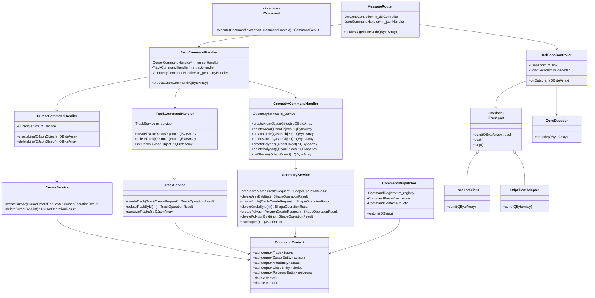
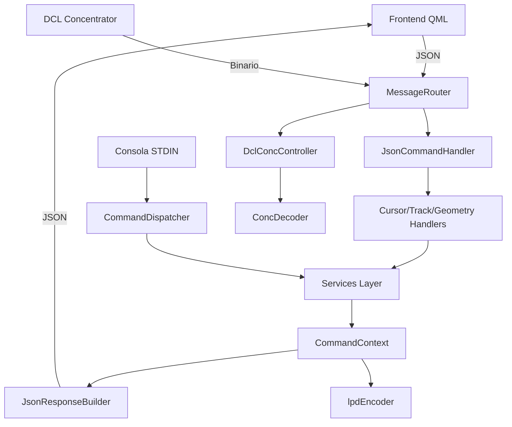

# Architecture Overview

## Class Diagram

## Runtime Flow

## Key Components

- Transport Layer: abstrae UDP y Local IPC mediante ITransport.
- MessageRouter: punto de entrada de red, decide JSON vs binario DCL.
- JsonCommandHandler: despacha comandos JSON a handlers específicos.
- Handlers: adaptadores de protocolo (parseo/validación/respuesta).
- Services: lógica de negocio compartida entre JSON y CLI.
- CommandContext: estado único del backend (tracks, cursores y figuras).
- CommandDispatcher: ejecuta comandos de consola sobre el mismo estado.

---

## Cambios recientes (Mar 2026)

- Se eliminó duplicación entre CLI y JSON moviendo reglas de negocio a CursorService, TrackService y GeometryService.
- Se añadieron comandos JSON de geometría faltantes: delete_polygon y list_shapes.
- CommandContext incorporó colecciones de areas, circles y polygons además de tracks/cursors.
- Se centralizó normalización angular en RadarMath::normalizeAngle360.
- Se resolvieron errores de compilación por tipos incompletos en headers de handlers/services y firmas inconsistentes en entidades.
- DDMController mantiene formateo de tracks para QML y la eliminación de track vía comando JSON delete_track.
