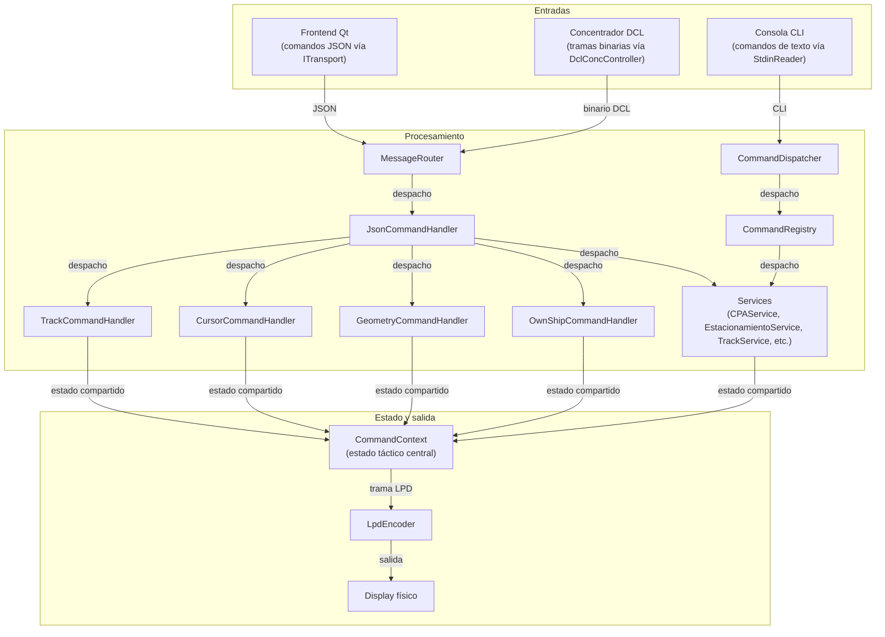

# Arquitectura del DDM Backend

## Descripción general

El DDM Backend es un servidor headless en C++/Qt que centraliza el estado táctico y actúa como puente entre tres canales operativos:

- Frontend Qt/QML (comandos JSON vía `ITransport`)
- Consola local (comandos CLI vía `CommandDispatcher`)
- Concentrador DCL (tramas binarias decodificadas por `ConcDecoder`)

El módulo existe para desacoplar UI, lógica táctica y protocolo de hardware. Su objetivo operativo es mantener un estado consistente único (`CommandContext`) y proyectarlo en dos direcciones:

- Respuestas JSON para cliente frontend
- Trama binaria LPD (`encoderLPD`) para display físico

Dentro de la arquitectura general del backend, `src/main.cpp` realiza el cableado de todos los componentes, `MessageRouter` es el punto único de entrada de mensajes de red, y `CommandContext` es la fuente de verdad compartida para tracks, cursores, geometrías, ownship, sesiones CPA y estacionamiento.

## Lista de archivos y clases

| Archivo | Clase/Struct | Responsabilidad |
|---|---|---|
| `src/main.cpp` | `main()` | Inicializa contexto, transporte, router, timers, CLI thread y conexiones de señales/slots. |
| `src/model/commandContext.h` | `CommandContext` | Estado táctico central compartido y utilidades de mutación/búsqueda. |
| `src/controller/messagerouter.h` | `MessageRouter` | Enrutamiento de datagramas: JSON a `JsonCommandHandler`, binario a `DclConcController`. |
| `src/controller/dclConcController.h` | `DclConcController` | Polling al concentrador, ACK por secuencia, inversión de payload y delegación a decoder. |
| `src/controller/json/jsoncommandhandler.h` | `JsonCommandHandler` | Punto de entrada de comandos JSON y despacho a handlers/servicios. |
| `src/controller/json/jsonresponsebuilder.h` | `JsonResponseBuilder` | Construcción estandarizada de respuestas JSON de éxito/error. |
| `src/controller/json/validators/jsonvalidator.h` | `JsonValidator`, `ValidationResult` | Validación de campos JSON (tipos, presencia, rangos, formato de IDs). |
| `src/controller/commanddispatcher.h` | `CommandDispatcher` | Despacha comandos de consola usando parser y registry. |
| `src/controller/commandRegistry.h` | `CommandRegistry` | Registro en memoria de implementaciones `ICommand`. |
| `src/controller/commands/iCommand.h` | `ICommand`, `CommandInvocation`, `CommandResult` | Contrato común de comandos CLI (Command Pattern). |
| `src/controller/handlers/trackcommandhandler.h` | `TrackCommandHandler` | Adaptador JSON para altas/bajas/listado de tracks. |
| `src/controller/handlers/cursorcommandhandler.h` | `CursorCommandHandler` | Adaptador JSON para altas/bajas/listado de líneas/cursores. |
| `src/controller/handlers/geometrycommandhandler.h` | `GeometryCommandHandler` | Adaptador JSON para áreas, círculos, polígonos y listado de figuras. |
| `src/controller/handlers/ownshipcommandhandler.h` | `OwnShipCommandHandler` | Adaptador JSON para actualización de ownship. |
| `src/controller/services/trackservice.h` | `TrackService`, `TrackCreateRequest`, `TrackOperationResult` | Lógica de negocio de tracks, validación y serialización. |
| `src/controller/services/cursorservice.h` | `CursorService`, `CursorCreateRequest`, `CursorOperationResult` | Lógica de negocio de cursores y conversión `LINE_n` ↔ id numérico. |
| `src/controller/services/geometryservice.h` | `GeometryService`, `GeometryResult` | Lógica de negocio para CRUD de geometrías y generación de cursores asociados. |
| `src/controller/services/ownshipservice.h` | `OwnShipService`, `OwnShipOperationResult` | Gestión de ownship, track virtual id 0 y recalculo PPP SITREP. |
| `src/controller/services/cpaservice.h` | `CPAService`, `CPATrackRef`, `CPAComputationResult`, `CPASession`, `CPAClearResult` | Cálculo/gestión de sesiones CPA/PPP y marcadores tácticos. |
| `src/controller/services/estacionamientoservice.h` | `EstacionamientoService`, `CalculationResult`, `OperationResult` | Orquestación de cálculo de estacionamiento y validación de opciones CLI/JSON. |
| `src/model/cpa.h` | `CPA`, `CPAResult` | Wrapper de cálculo CPA reutilizando `PppCalculator`. |
| `src/model/pppcalculator.h` | `PppCalculator`, `KinematicState`, `Result` | Motor matemático puro para PPP/CPA entre dos estados cinemáticos. |
| `src/model/estacionamientocalculator.h` | `EstacionamientoCalculator`, `KinematicState`, `Input`, `Result` | Motor matemático puro para solución de estacionamiento relativo. |
| `src/model/decoders/iDecoder.h` | `IDecodificator` | Interfaz base de decodificadores binarios. |
| `src/model/decoders/concDecoder.h` | `ConcDecoder`, `RollingSteps` | Decodificación de tramas DCL y emisión de señales tácticas/eventos de control. |
| `src/model/decoders/lpdEncoder.h` | `encoderLPD` | Codificación de estado táctico a protocolo LPD (tracks, cursores, marcadores). |
| `src/model/network/iTransport.h` | `ITransport` | Abstracción de transporte de mensajes (send/start/stop + señales). |
| `src/model/network/udpClientAdapter.h` | `UdpClientAdapter` | Adaptador de `clientSocket` al contrato `ITransport`. |
| `src/model/network/localipcclient.h` | `LocalIpcClient` | Cliente IPC local con framing por longitud y reconexión automática. |
| `src/model/network/clientSocket.h` | `clientSocket` | Socket UDP concreto (bind/read/write datagrams). |
| `src/model/network/transportFactory.h` | `TransportKind`, `TransportOpts` | Definición de tipos/opciones para factoría de transporte. |
| `src/model/network/transportFactory.cpp` | `makeTransport(...)` | Fábrica de `ITransport` para UDP o Local IPC según configuración. |
| `src/controller/overlayHandler.h` | `OverlayHandler` | Selección de overlay activo y despacho de teclas QEK sobre su implementación. |
| `src/model/obm/obmHandler.h` | `OBMHandler` | Manejo de posición/rango OBM y asociación de track cercano. |
| `src/model/ownCursor/owncurs.h` | `OwnCurs` | Control del cursor propio con handwheel y estados de centrado. |
| `src/view/commandParser.h` | `CommandParser` | Tokenización de línea CLI y llenado de `CommandInvocation`. |
| `src/view/iInputParser.h` | `IInputParser` | Interfaz de parsing para desacoplar el dispatcher. |
| `src/view/stdinreader.h` | `StdinReader` | Lectura bloqueante de stdin en thread separado y emisión de líneas. |

## Clases principales

### CommandContext

- **Rol**: Contenedor de estado compartido del backend. Almacena tracks, cursores, áreas, círculos, polígonos, ownship, centro táctico, marcadores CPA y sesiones de estacionamiento. También concentra operaciones de búsqueda, alta/baja y actualización cinemática (`updateTracks`) para mantener consistencia entre módulos CLI/JSON/LPD.
- **Métodos clave**:

| Método | Firma | Descripción |
|---|---|---|
| Constructor | `CommandContext()` | Inicializa streams UTF-8 y estado por defecto. |
| Emplace track | `template <typename... Args> Track& emplaceTrackFront(Args&&... args)` | Inserta track al frente sin copia adicional. |
| Emplace cursor | `template <typename... Args> CursorEntity& emplaceCursorFront(Args&&... args)` | Inserta cursor al frente y devuelve referencia. |
| Búsqueda track | `Track* findTrackById(int id)` | Busca track por id para mutaciones/lógica de negocio. |
| Borrado track | `bool eraseTrackById(int id)` | Elimina track por id. |
| Borrado cursor | `bool eraseCursorById(int id)` | Elimina cursor por id. |
| Centro táctico | `void setCenter(QPair<float,float> c)` | Actualiza centro X/Y del display. |
| Reset centro | `void resetCenter()` | Restablece centro a origen. |
| Modo movimiento | `void setMotionMode(MotionMode mode)` | Cambia entre `RELATIVE` y `TRUE_MOTION`. |
| Extrapolación | `void updateTracks(double deltaTime)` | Actualiza cinemática de tracks y recalcula sesiones de estacionamiento activas. |
| Persistencia CPA | `void upsertCpaMarker(const CpaMarkerState& marker)` | Inserta/actualiza marcador CPA por `sessionId`. |
| Persistencia EST | `bool upsertStationingSession(const StationingSession& session)` | Inserta/actualiza sesión EST (slots 1..10). |

- **Structs/Tipos definidos**:
- `MotionMode`: modo de movimiento (`RELATIVE`, `TRUE_MOTION`).
- `SitrepExtra`: información adicional por track para SITREP.
- `OwnShipState`: estado de ownship (posición, rumbo, velocidad, validez, metadatos UTC).
- `CpaMarkerState`: marcador táctico para graficación CPA en LPD.
- `StationingSession`: parámetros y resultados persistidos de estacionamiento por slot.
- **Dependencias**:
- `Track`, `CursorEntity`, `AreaEntity`, `CircleEntity`, `PolygonoEntity`
- `EstacionamientoCalculator`
- `ITransport`

### MessageRouter

- **Rol**: Punto único de entrada de mensajes provenientes de `ITransport`. Aplica criterio de ruteo liviano por contenido de datagrama: JSON (si comienza con `{` y termina con `}`) o binario DCL.
- **Métodos clave**:

| Método | Firma | Descripción |
|---|---|---|
| Constructor | `MessageRouter(DclConcController* dclController, JsonCommandHandler* jsonHandler, QObject* parent = nullptr)` | Inyecta controladores destino y valida punteros. |
| Slot de entrada | `void onMessageReceived(const QByteArray& datagram)` | Enruta datagrama al controlador correspondiente. |

- **Structs/Tipos definidos**: No aplica.
- **Dependencias**:
- `DclConcController`
- `JsonCommandHandler`

### JsonCommandHandler

- **Rol**: Entrada principal de comandos JSON del frontend. Parsea el documento, extrae `command/args`, resuelve handler por `m_commandMap` y envía respuesta por `ITransport`. Además mantiene sesiones CPA indexadas para `ppp_graph`, `ppp_finish` y `ppp_clear_track`.
- **Métodos clave**:

| Método | Firma | Descripción |
|---|---|---|
| Constructor | `JsonCommandHandler(CommandContext* context, ITransport* transport, ObmService* obmService, QObject* parent = nullptr)` | Crea handlers/servicios e inicializa mapa de comandos. |
| Entrada JSON | `void processJsonCommand(const QByteArray& jsonData)` | Parsea JSON y enruta por nombre de comando. |
| Refresh CPA | `void refreshActiveCpaSessions()` | Recalcula sesiones CPA activas periódicamente (invocado por timer en `main`). |
| Inicialización mapa | `void initializeCommandMap()` | Registra lambdas para comandos `create_track`, `create_line`, `cpa_start`, `estacionamiento_calc`, etc. |
| Parseo | `bool parseJson(const QByteArray& jsonData, QJsonObject& outObject)` | Valida JSON válido y objeto raíz. |
| Routing | `void routeCommand(const QString& command, const QJsonObject& args)` | Busca y ejecuta handler desde `m_commandMap`. |
| Respuesta | `void sendResponse(const QByteArray& responseData)` | Envía payload por transporte y loggea fallo de envío. |
| CPA start | `QByteArray handleCpaStart(const QJsonObject& args)` | Inicia sesión CPA y devuelve datos de TCPA/DCPA. |
| PPP graph | `QByteArray handlePppGraph(const QJsonObject& args)` | Reconsulta sesión CPA activa para graficación. |
| EST calc | `QByteArray handleEstacionamiento(const QJsonObject& args)` | Valida entrada, ejecuta cálculo EST y persiste sesión en contexto. |

- **Structs/Tipos definidos**:
- `CommandHandler`: alias funcional `std::function<QByteArray(const QJsonObject&)>`.
- **Dependencias**:
- `TrackCommandHandler`, `CursorCommandHandler`, `GeometryCommandHandler`, `OwnShipCommandHandler`
- `CPAService`, `EstacionamientoService`
- `JsonResponseBuilder`
- `ITransport`, `CommandContext`, `ObmService`

### DclConcController

- **Rol**: Controlador del canal binario DCL. Realiza polling periódico al concentrador, valida tamaño mínimo de datagrama, extrae secuencia para ACK, invierte payload y lo entrega a `ConcDecoder`.
- **Métodos clave**:

| Método | Firma | Descripción |
|---|---|---|
| Constructor | `DclConcController(ITransport* link, ConcDecoder* decodificator, QObject* parent = nullptr)` | Configura timer de polling cada 50 ms. |
| Poll concentrador | `void askForConcentrator()` | Envía pedido DCL periódico (`buildPedidoDclConc`). |
| Entrada datagrama | `void onDatagram(const QByteArray&)` | Construye y envía ACK; decodifica payload si existe. |
| Inversión de payload | `QByteArray negateData(const QByteArray &data)` | Invierte bits de cada byte para normalizar datos recibidos. |
| Pedido DCL | `static QByteArray buildPedidoDclConc()` | Construye trama fija de solicitud al concentrador. |
| ACK secuencia | `static QByteArray buildAckFromSeq(quint16)` | Genera ACK con bit MSB y secuencia de 15 bits. |

- **Structs/Tipos definidos**: No aplica.
- **Dependencias**:
- `ITransport`
- `ConcDecoder`
- `QTimer`

### ConcDecoder

- **Rol**: Decodificador binario del protocolo de concentrador. Interpreta palabras de 24 bits y emite señales Qt de eventos tácticos (overlay, QEK, range, handwheel, rolling ball, centrado y own cursor).
- **Métodos clave**:

| Método | Firma | Descripción |
|---|---|---|
| Constructor | `ConcDecoder()` | Inicializa decodificador. |
| Decode | `void decode(const QByteArray &message) override` | Ejecuta pipeline de decodificación por palabras (`decodeWord1..`). |
| Decodificación palabra 1 | `void decodeWord1()` | Range scale, display selection y threat assessment. |
| Decodificación palabra 2 | `void decodeWord2()` | Señales de centro/own cursor con detección de flancos. |
| Decodificación palabra 4 | `void decodeWord4()` | QEK master/slave. |
| Decodificación palabra 5 | `void decodeWord5()` | ICM y overlays master/slave. |
| Decodificación palabra 6 | `void decodeWord6()` | Handwheel ΔΦ/Δρ. |
| Decodificación palabra 7 | `void decodeWord7()` | Rolling ball ΔX/ΔY con sign-extend. |

- **Structs/Tipos definidos**:
- `RollingSteps`: contenedor de bytes de pasos de rolling ball.
- **Dependencias**:
- `IDecodificator`
- `QBitArray`, `QJsonObject`
- `OverlayHandler`, `OBMHandler`, `OwnCurs` (vía señales conectadas en `main`)

### encoderLPD

- **Rol**: Codifica el estado táctico del `CommandContext` al formato binario del display LPD. Incluye centro, OBM, tracks AB2, cursores AB3, marcadores CPA y sesiones de estacionamiento.
- **Métodos clave**:

| Método | Firma | Descripción |
|---|---|---|
| Build mensaje | `QByteArray buildFullMessage(const CommandContext &ctx)` | Construye trama completa y aplica negación de datos desde offset fijo. |
| Inyección OBM | `void setOBMHandler(OBMHandler* oh)` | Provee fuente de posición OBM para codificación. |
| Track AB2 | `void appendAB2Message(QByteArray& dst, const Track &track)` | Codifica coordenadas + símbolo/modo/ID track. |
| Cursor AB3 | `void appendAB3Message(QByteArray& dst, const CursorEntity &cursor)` | Codifica ángulo, longitud y coordenadas cursor. |
| Marcador CPA | `void appendCpaMarkerMessage(QByteArray& dst, const CommandContext::CpaMarkerState& marker)` | Emite símbolo fijo para marcador CPA. |
| Marcador EST | `void appendStationingMarkerMessage(QByteArray& dst, const CommandContext::StationingSession& session)` | Emite marcador de sesión de estacionamiento por slot. |
| Coordenada | `void appendCoordinate(QByteArray& dst, double value, uint8_t idBits, bool AP=true, bool PV=false, bool LS=false)` | Cuantiza y empaqueta coordenadas a palabra de 24 bits. |

- **Structs/Tipos definidos**: No aplica en clase (usa constantes `AB*`, bits de control y `EOMM` en el header).
- **Dependencias**:
- `CommandContext`
- `Track`, `CursorEntity`
- `OBMHandler`

### CommandDispatcher

- **Rol**: Ejecutor de comandos de consola. Recibe líneas desde `StdinReader`, parsea con `IInputParser`, resuelve el comando en `CommandRegistry` y ejecuta `ICommand::execute` sobre `CommandContext`.
- **Métodos clave**:

| Método | Firma | Descripción |
|---|---|---|
| Constructor | `CommandDispatcher(CommandRegistry* reg, IInputParser* parser, CommandContext& ctx, QObject* parent = nullptr)` | Inyecta registry/parser/context. |
| Slot de línea | `void onLine(const QString& line)` | Gestiona `help`, `exit/salir`, parseo, lookup y ejecución. |

- **Structs/Tipos definidos**: No aplica.
- **Dependencias**:
- `CommandRegistry`
- `IInputParser`
- `ICommand`
- `CommandContext`

### ICommand

- **Rol**: Contrato del patrón Command para CLI. Cada comando concreto implementa nombre, descripción, uso y ejecución sobre contexto compartido.
- **Métodos clave**:

| Método | Firma | Descripción |
|---|---|---|
| Nombre | `virtual QString getName() const = 0` | Identificador textual del comando. |
| Descripción | `virtual QString getDescription() const = 0` | Texto para `help`. |
| Uso | `virtual QString usage() const = 0` | Sintaxis esperada. |
| Ejecución | `virtual CommandResult execute(const CommandInvocation& inv, CommandContext& ctx) const = 0` | Lógica del comando sobre estado global. |

- **Structs/Tipos definidos**:
- `CommandInvocation`: nombre, path, opts y args parseados.
- `CommandResult`: resultado simple (`ok`, `message`).
- **Dependencias**:
- `CommandContext`

### ITransport

- **Rol**: Abstracción uniforme de transporte para backend. Permite cambiar entre UDP y Local IPC sin modificar controladores.
- **Métodos clave**:

| Método | Firma | Descripción |
|---|---|---|
| Envío | `virtual bool send(const QByteArray& data) = 0` | Envía payload al peer remoto/local. |
| Conectividad | `virtual bool isConnected() const` | Estado de conexión (override según implementación). |
| Inicio | `virtual void start()` | Inicializa transporte. |
| Stop | `virtual void stop()` | Cierra transporte. |

- **Structs/Tipos definidos**: No aplica.
- **Dependencias**:
- Implementaciones `UdpClientAdapter` y `LocalIpcClient`

### CPAService

- **Rol**: Servicio de aplicación para sesiones CPA/PPP entre referencias tácticas. Resuelve tracks (incluyendo ownship), calcula métricas con estado relativo, gestiona ciclo de vida de sesiones y persiste marcadores en `CommandContext`.
- **Métodos clave**:

| Método | Firma | Descripción |
|---|---|---|
| Inicio sesión | `CPAComputationResult startCPA(const CPATrackRef& trackA, const CPATrackRef& trackB)` | Crea/activa sesión y retorna cálculo inicial. |
| Graficación | `CPAComputationResult graphCPA(const QString& sessionId)` | Recalcula CPA para sesión existente. |
| Cálculo directo | `CPAComputationResult computeCPA(const CPATrackRef& trackA, const CPATrackRef& trackB) const` | Cálculo puntual sin cambiar estado de sesión. |
| Finalización | `bool finishCPA(const QString& sessionId)` | Marca/limpia sesión activa. |
| Limpieza por track | `CPAClearResult clearTrack(const CPATrackRef& trackRef)` | Remueve sesiones y marcadores asociados a un track. |

- **Structs/Tipos definidos**:
- `CPATrackRef`: referencia a track o ownship.
- `CPAComputationResult`: resultado de cálculo y metadatos de sesión.
- `CPASession`: estado (`Active`, `Finished`, `Expired`) y tracks involucrados.
- `CPAClearResult`: contadores de sesiones/marcadores removidos.
- **Dependencias**:
- `CommandContext`
- Cálculo cinemático CPA (lógica interna del servicio)

## Flujo de datos

### Flujo de entrada por red

1. `ITransport` emite `messageReceived(QByteArray)`.
2. `MessageRouter::onMessageReceived` decide destino.
3. JSON -> `JsonCommandHandler::processJsonCommand`.
4. Binario -> `DclConcController::onDatagram` -> `ConcDecoder::decode`.

### Flujo de entrada por consola

1. `StdinReader` corre en hilo dedicado (`QThread`) y emite `lineRead`.
2. `CommandDispatcher::onLine` parsea (`CommandParser`) y resuelve comando (`CommandRegistry`).
3. Comando concreto implementa `ICommand::execute` y muta `CommandContext`.

### Flujo interno de procesamiento JSON

Frontend JSON -> `JsonCommandHandler` -> handler especializado (`TrackCommandHandler` / `CursorCommandHandler` / `GeometryCommandHandler` / `OwnShipCommandHandler`) -> servicio (`TrackService`, etc.) -> `CommandContext` -> `JsonResponseBuilder` -> `ITransport::send`.

### Flujo de salida a display LPD

1. Timer en `main` cada 40 ms.
2. `encoderLPD::buildFullMessage(*ctx)` serializa estado actual.
3. `ITransport::send(...)` transmite trama binaria.

## Manejo de errores

El módulo maneja errores por capas, con códigos explícitos y retorno seguro:

- Parseo JSON:
  - `JsonCommandHandler::parseJson` detecta JSON inválido y raíz no-objeto.
  - Respuesta: `JsonResponseBuilder::buildErrorResponse` con código `INVALID_JSON`.

- Comando desconocido:
  - `JsonCommandHandler::routeCommand` valida presencia en `m_commandMap`.
  - Respuesta: `UNKNOWN_COMMAND`.

- Validación de argumentos:
  - `JsonValidator` retorna `ValidationResult` estructurado.
  - `JsonResponseBuilder::buildValidationErrorResponse` estandariza error por campo.

- Servicios de dominio:
  - `TrackService`, `CursorService`, `GeometryService`, `OwnShipService`, `CPAService`, `EstacionamientoService` retornan resultados con `success/errorCode/message`.
  - Los handlers traducen estos resultados a JSON de error o éxito.

- Transporte:
  - `JsonCommandHandler::sendResponse` verifica `send(...)` y loggea warning si falla.
  - `LocalIpcClient` emite señal `error(...)` para errores de socket no esperados.

- Entrada binaria DCL:
  - `DclConcController::onDatagram` corta temprano si tamaño < 3 bytes.
  - ACK se construye antes de decodificar payload para robustez de enlace.

- CLI:
  - `CommandDispatcher` reporta errores de parseo, comando desconocido o fallo de ejecución (`CommandResult.ok=false`) sin terminar el proceso.

## Módulos relacionados

- `docs/README_BACKEND_ARCHITECTURE.md`: documentación ampliada de backend y API JSON.
- `docs/COMBINED_PROJECTS.md`: vista consolidada de integración entre componentes y proyectos.
- `docs/PPP_SYSTEM.md`: detalle funcional/técnico del sistema PPP.
- `docs/STATIONING_SYSTEM.md`: especificación funcional y técnica del sistema de estacionamiento.
- `docs/CPA_PPP_END_TO_END_VERIFICATION.md`: validación integral de flujos CPA/PPP.
- `docs/COMPILATION_AND_TEST_GUIDE.md`: guía de compilación y verificación.
- `docs/VERIFICATION_STATUS.md`: estado consolidado de validaciones.
