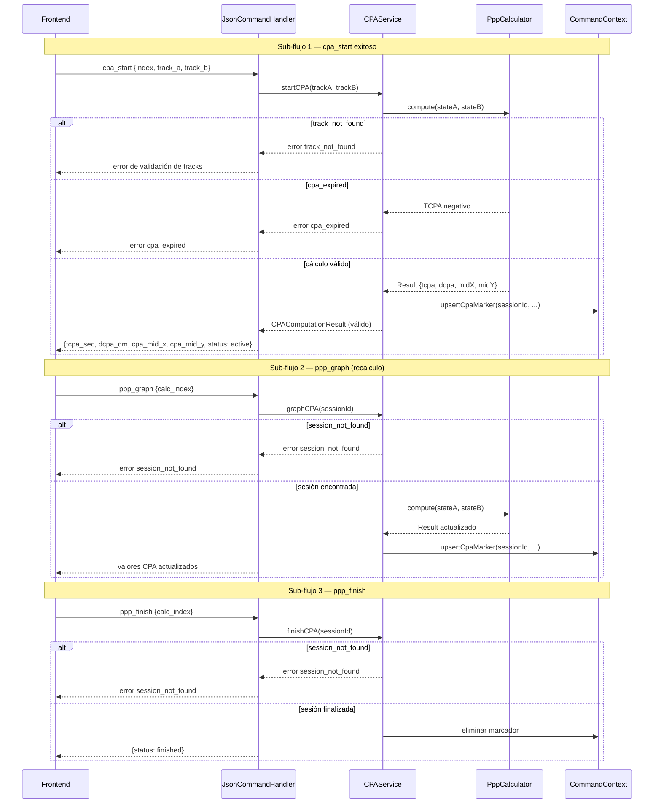

# Flujo: CPA / PPP

## Descripción general

Este flujo cubre el cálculo de aproximación táctica mínima (CPA) y su relación con el motor matemático PPP reutilizable (`PppCalculator`).

En el backend hay dos rutas principales:

- Ruta JSON operacional (`cpa_start`, `ppp_graph`, `ppp_finish`, `ppp_clear_track`) usando `CPAService`.
- Ruta CLI `cpa` (`CpaCommand`) que en el estado actual está implementada de forma parcial (salida textual placeholder).

## Lista de archivos y clases

| Archivo | Clase/Struct | Responsabilidad |
|---|---|---|
| `src/controller/services/cpaservice.h` | `CPAService`, `CPATrackRef`, `CPAComputationResult`, `CPASession` | Orquesta cálculo CPA, sesiones activas y marcadores en contexto. |
| `src/controller/commands/cpaCommand.cpp` | `CpaCommand` | Comando CLI `cpa` con parseo básico de ids y salida textual. |
| `src/model/cpa.h` | `CPA`, `CPAResult` | Clase de cálculo CPA basada en `PppCalculator`. |
| `src/model/pppcalculator.h` | `PppCalculator` | Motor matemático base para cálculo relativo (azimut, distancia, tiempo). |
| `src/controller/json/jsoncommandhandler.cpp` | `JsonCommandHandler` | Mapea comandos JSON de CPA/PPP a `CPAService`. |
| `src/model/commandContext.h` | `CommandContext::CpaMarkerState` | Persistencia de marcadores CPA para salida LPD. |

## Clases principales

### CPAService

- **Rol**: servicio principal del flujo CPA/PPP en runtime JSON.
- **Métodos clave**:

| Método | Firma | Descripción |
|---|---|---|
| Inicio | `CPAComputationResult startCPA(const CPATrackRef& trackA, const CPATrackRef& trackB)` | Inicia sesión CPA y cálculo inicial. |
| Graficar | `CPAComputationResult graphCPA(const QString& sessionId)` | Recalcula y actualiza marcador de sesión activa. |
| Cálculo directo | `CPAComputationResult computeCPA(const CPATrackRef& trackA, const CPATrackRef& trackB) const` | Evalúa CPA sin alterar sesión. |
| Finalizar | `bool finishCPA(const QString& sessionId)` | Marca sesión como finalizada y elimina marcador. |
| Limpiar por track | `CPAClearResult clearTrack(const CPATrackRef& trackRef)` | Elimina sesiones/marcadores asociados. |
| Estado | `bool isSessionActive(const QString& sessionId) const` | Verifica si sesión sigue activa. |

- **Structs/Tipos definidos**:
- `CPATrackRef` (`isOwnShip`, `trackId`)
- `CPAComputationResult`
- `CPASession`
- `CPAClearResult`
- **Dependencias**:
- `CommandContext`
- `PppCalculator`

### PppCalculator

- **Rol**: núcleo matemático reutilizable para estado relativo entre dos cinemáticas.
- **Métodos clave**:

| Método | Firma | Descripción |
|---|---|---|
| Compute | `static Result compute(const KinematicState& reference, const KinematicState& target)` | Retorna azimut/distancia/tiempo y estado de validez. |

- **Structs/Tipos definidos**:
- `KinematicState`
- `Result` (`Valid`, `DegenerateRelativeMotion`, `InvalidInput`)
- **Dependencias**:
- `RadarMath`

### CpaCommand

- **Rol**: entrada CLI para consulta CPA entre dos ids.
- **Métodos clave**:

| Método | Firma | Descripción |
|---|---|---|
| Ejecutar | `CommandResult execute(const CommandInvocation &inv, CommandContext &ctx) const` | Parsea dos ids y retorna salida textual. |

- **Structs/Tipos definidos**: No aplica.
- **Dependencias**:
- `CPAService`

## Flujo de datos

### Flujo JSON CPA/PPP

1. `JsonCommandHandler` recibe `cpa_start`.
2. Valida `index` y par de tracks (`track_a`, `track_b`) con `parseTrackPair`.
3. Llama `CPAService::startCPA`.
4. Si es válido:
   - guarda relación `calc index -> sessionId`
   - responde `tcpa_sec`, `dcpa_dm`, `cpa_mid_x`, `cpa_mid_y`, `status=active`.

5. Para `ppp_graph`:
   - resuelve sesión por `calc_index`
   - llama `graphCPA(sessionId)`
   - actualiza marcador en contexto y responde valores CPA.

6. Para `ppp_finish`:
   - finaliza sesión y elimina marcador.

7. Para `ppp_clear_track`:
   - finaliza y limpia referencias asociadas al cálculo.

### Núcleo matemático

`CPAService` transforma tracks/ownship a `PppCalculator::KinematicState` y delega el cálculo al motor PPP. Con el resultado reconstruye:

- TCPA en segundos
- DCPA en DM
- punto medio CPA (`cpaMidX`, `cpaMidY`)

### Flujo CLI actual

1. `CpaCommand` parsea dos ids.
2. Crea `CPAService` pero actualmente no invoca cálculo final (líneas comentadas).
3. Retorna texto placeholder con ids.

## Manejo de errores

- `same_track`: se rechaza si ambos tracks son el mismo.
- `own_ship_not_allowed_in_track_b`: ownship solo permitido en `track_a`.
- `own_ship_not_set`: ownship no configurado.
- `track_not_found`: id inexistente.
- `cpa_expired`: TCPA negativo (CPA ya ocurrió).
- `session_not_found` / `session_inactive`: sesión inválida o cerrada.
- En JSON, estos errores se propagan como `buildErrorResponse(...)`.

## Módulos relacionados

- `docs/protocols/json-command-api.md`
- `docs/modules/services.md`
- `docs/modules/command-context.md`
- `docs/PPP_SYSTEM.md`
- `docs/CPA_PPP_END_TO_END_VERIFICATION.md`
